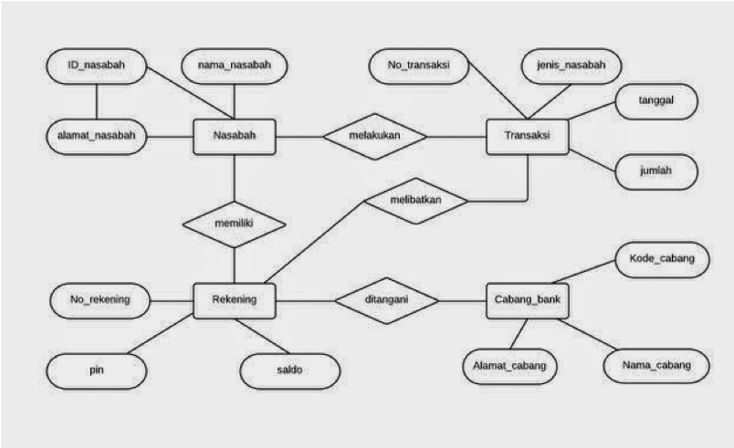

# Jobsheet-2: Entity Relationship Diagram (ERD)

## Topik
Entity Relationship Diagram (ERD) 

## Tujuan
1.	Mahasiswa mampu merancang basis data melalui tahap-tahap perancangannya
2.	Mahasiswa mampu mewujudkan hasil perancangan basis data ke dalam diagram E-R secara manual

## Teori
Basis data adalah kumpulan data, yang dapat digambarkan sebagai aktivitas dari satu atau lebih organisasi yang berelasi. 
Contoh, basis data universitas yang berisi informasi mengenai: 
-	Entitas, semisal mahasiswa, fakultas, mata kuliah, dan ruang kelas
-	Relasi diantara entitas, seperti pengambilan kuliah yang dilakukan oleh mahasiswa, staf pengajar, dan penggunaan 
ruang perkuliahan.

+ ER – Model

    ER model digunakan sebagai inisialisasi desain dari basis data. ER model menyediakan suatu konsep yang dapat mengubah 
    deskripsi informal dari apa yang diinginkan oleh user menjadi hal yang lebih detail, presisi, dan deskripsi detail yang 
    dapat diimplementasikan ke dalam DBMS. 
+ Entitas 

    Entitas adalah suatu obyek yang dapat dikenali dari objek yang lain. Objek yang dapat menjadi entitas adalah objek-objek 
    yang nantinya perlu untuk disimpan datanya.
    Contoh: karyawan, perusahaan, peristiwa, tanaman dan lain – lain. 
    Entitas memiliki atribut, contoh: entitas penduduk mempunyai nama, alamat, tanggal lahir, pekerjaan, dan golongan darah.
     
+ Attribut

    Entitas direpresentasikan oleh sekumpulan atribut, yang mana properti deskriptifnya dikuasai oleh seluruh anggota 
    dalam kumpulan entitas.
    
    Tipe atribut:
    
    1. `Simple (sederhana) dan composite (gabungan) attributes.`
    2. `Single-valued (satu-nilai) dan multi-valued (multi-nilai) attributes.`
    Contoh : attribute multi-valued: nomor telepon.
    3.  `Derived (turunan) attributes` : dapat diperhitungkan dari attribute lain.
    Contoh : umur, tanggal kelahiran.
    
+ Kardinalitas

    Merepresentasikan jumlah relasi entitas ke entitas yang lain. Jenis kardinalitas harus memenuhi salah satu tipe berikut:
    1.	One to one (satu ke satu)
    2.	One to many (satu ke banyak)
    3.	Many to one (banyak ke satu)
    4.	Many to many (banyak ke banyak)
    
+ ERD (Entity Relationship Diagram)

    hubungan antara entities (table-tabel) dan relationships (hubungan-hubungan) diantara entities tersebut

## Aturan untuk Model Database
1. Tiap baris harus berdiri sendiri (independent): tidak tergantung baris-baris yang lain, dan urutan baris tidak 
mempengaruhi model database.
2. Tiap baris harus unik: tidak boleh ada 2 atau lebih baris yang sama.
3. Kolom harus berdiri sendiri (independent): tidak tergantung kolom-kolom yang lain, dan urutan kolom tidak mempengaruhi 
model database.
4. Nilai tiap kolom harus berupa satu kesatuan: tidak berupa sebuah daftar.

## Tahap Pembuatan Database
1. Tentukan Entities
2. Tentukan Attributes
3. Tentukan Relationships
4. Pembuatan ERD
5. Pembentukan rancangan fisik Database
6. Implementasi Database 

## Langkah Kerja
### Rancanglah sebuah database untuk menyelesaikan masalah berikut:
Suatu perusahaan software diminta membuatkan basis data yang akan menangani data-data perbankan. Data-data yang 
ditanganinya adalah: data pribadi mengenai nasabah, data account deposit yang dimiliki oleh nasabah, cabang bank 
di mana nasabah membuka depositnya, dan data transaksi yang dilakukan nasabah. Nasabah boleh mempunyai lebih dari 
satu account deposit, dan satu account deposit boleh dimiliki oleh lebih dari satu nasabah sekaligus (join account).

Langkah-langkah perancangan database perbankan :
1.	Menentukan entitas (object-object dasar) yang perlu ada didatabase.

        + Nasabah: menyimpan semua data pribadi semua nasabah
        + Rekening: menyimpan informasi semua rekening yang telah dibuka
        + Cabang_bank: menyimpan informasi tentang semua cabang bank
        + Transaksi: menyimpan informasi tentang semua transaksi yang telah terjadi
    
2.	Menentukkan atribut (sifat-sifat) masing-masing entity sesuai kebutuhan database

        + Nasabah
            - id_nasabah: nomor id untuk nasabah (integer) PK
            - nama_nasabah: nama lengkap nasabah (varchar(45))
            - alamat_nasabah: alamat lengkap nasabah (varchar(255))
            
        + Rekening
            - no_rekening: nomor rekening (integer) PK
            - pin: Personal Identification Number (varchar(10))
            - saldo: Jumlah saldo rekening dalam Rp (integer)

        + Cabank_bank
        
            - kode_cabang: kode untuk cabang bank (varchar(10)) PK
            - nama_cabang: nama lengkap cabang bank (varchar(20))
            - alamat_cabang: alamat lengkap cabang bank (varchar(255)) 

        + Transaksi
            - no_transaksi: nomor transaksi (integer) PK
            - jenis_transaksi: kredit atau debit (varchar(10))
            - tanggal: tanggal terjadinya transaksi (date)
            - jumlah: besarnya transaksi dalam Rp (integer)

3.	Menentukan Relationship (Hubungan) diantara entities tersebut

        |               | Nasabah   | Rekening  | Cabang_Bank   | Transaksi |
        | ------------- | --------- | --------- | ------------- | --------- |
        | Nasabah       |           | M:N       | -             | 1:N       |
        | Rekening      |           |           | N:1           | 1:N       |
        | Cabang_Bank   |           |           | -             |           |
        | Transaksi     |           |           | -             |           |

        Hubungan
                
        a. nasabah memiliki rekening:
         
        + Tabel utama : nasabah, rekening
        + Tabel kedua : nasabah_has_rekening
        + Relationship : Many-to-many (m : n) 
        + Attribute penghubung : id_nasabah, no_rekening (FK id_nasabah, no_rekening, dinasabah_has_rekening)
                 
        b. nasabah melakukan transaksi:
          
        + Tabel utama : nasabah
        + Tabel kedua : transaksi
        + Relationship : One-to-many (1 : n)
        + Attribute penghubung : id_nasabah, (FK id_nasabah, di transaksi)
                
        c. cabang_bank menangani rekening:
          
        + Tabel utama : cabang_bank
        + Tabel kedua : rekening
        + Relationship : One-to-many (1 : n)
        + Attribute penghubung : kode_cabang (FK kode_cabang di rekening)
                
        d. rekening terlibat dalam transaksi :  
        + Tabel utama : rekening
        + Tabel kedua : transaksi
        + Relationship : One-to-many (1 : n)
        + Attribute penghubung : no_rekening (FK no_rekening, di transaksi)

4. Menggambar E-R Diagram Manual:

    

## TUGAS
1.	Buatlah rancangan sebuah database untuk menangani data perkuliahan. Data-data yang akan ditanganinya adalah: data 
pribadi mengenai mahasiswa, data pribadi mengenai dosen, data mata kuliah dan data ruang kelas. Mahasiswa boleh mengambil 
lebih dari satu mata kuliah, dan satu mata kuliah bisa diampu oleh lebih dari satu dosen. Satu kelas mata kuliah boleh 
diambil oleh lebih dari satu mahasiswa sekaligus.
Buatlah ER Diagram manual untuk kasus tersebut dari tahap 1 sampai tahap 4!
2.	 Ambil contoh sembarang database, boleh dari sistem atau aplikasi yang sudah ada. Buatlah rancangan ER Diagram 
manual database tersebut dari tahap 1-4 dengan ketentuan database minimal mengandung 4 buah entitas.