# Entitry Relationship Diagram Bagian Ke-2

## Topik
1. Pemodelan data Top-Down & Bottom-Up
2. Variasi ERD
3. CASE Tools

## Tujuan
Mahasiswa diharapkan memperoleh pemahaman lebih lanjut mengenai ERD dan hubungannya dengan pemodelan data, variasi ERD, 
dan tools yang dapat digunakan untuk membuat ERD (Versi Chen)

## Pendahuluan
### Pemodelan Data
Definisi singkat (dalam lingkup software engineering) untuk pemodelan data adalah proses pembuatan model data (data model) 
untuk sebuah sistem informasi yang melibatkan teknik-teknik formal tertentu. Dalam definisi yang lebih lengkap, data 
modelling berarti sebuah proses penganalisisan persyaratan- persyaratan data (data requirements) yang dibutuhkan untuk 
mendukung terlaksananya proses-proses bisnis (business processes) dalam lingkup sistem informasi pada suatu organisasi.

Tujuan utama dari data modelling adalah mengubah persyaratan-persyaratan data pengguna menjadi basisdata yang sesungguhnya 
(actual database) yang memenuhi persyaratan-persyaratan tersebut. Shingga data modelling perlu dilakukan untuk memastikan 
sistem informasi yang dihasilkan nantinya dapat berfungsi secara benar dan tepat, sesuai dengan persyaratan organisasi 
yang menggunakannya.

### Data Model
Hasil dari pemodelan data adalah model data (data model). Data model adalah sebuah model (yang berarti perumpamaan atau 
analogi) abstrak yang mewakili dan menjelaskan hubungan antara elemen-elemen data pada suatu entitas (objek) di dunia nyata.

Contohnya, apabila kita menjumpai data dunia nyata seperti berikut:
"sebuah mobil berwarna putih buatan tahun 2017, dimiliki oleh seorang dosen bernama Muhammad Ali." Maka kita dapat membuat 
sebuah model yang merepresentasikan sifat-sifat mobil dan pemilik berikut hubungan atara keduanya:

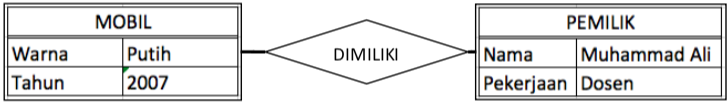

Tampilan/bentuk model yang dihasilkan dapat berupa apa saja, namun dalam membuat suatu model kita harus meyakinkan bahwa 
karakteristik utama dari model semuanya telah ada. Karakteristik utamanya adalah, sebuah model harus dapat menggambarkan 
dan mewakili jumlah/nilai data yang dimiliki oleh entitasnya berikut hubungan antara masing-masing entitas yang terlibat

Berdasarkan urut-urutan/fase pengembangan dari requirements menuju actual database, data model terbagi menjadi 3 garis besar:
1. Conseptual Data Model (CDM)

    Berisi gambaran umum data-data yang harus disimpan berikut signifikansinya pada proses bisnis suatu organisasi. Sifat 
    dari model ini relatif sederhana, idak melibatkan istilah teknis, dan bisa dimengerti oleh semua level manajemen dari 
    lingkungan IT maupun non-IT. Salah satu diagram yang dapat digunakan untuk merepresentasikan model ini adalah Data 
    Structure Diagram (DSD).
    
1. Logical Data Model (LDM)

    Berisi gambaran lebih detail mengenai entitas-entitas yang terlibat, atribut, dan hubungan antara satu dengan yang 
    lainnya. Model ini melibatkan entitas, atribut, dan relationship, serta mulai menggunakan istilah-istilah teknis 
    yang berhubungan denga proses bisnis organisasinya. 1 CDM dapat membutuhkan 1 atau lebih LDM. Untuk menggambarkan 
    model ini kita dapat menggunakan Entity Relationship Diagram (ERD)
    
1. Physical Data Model (PDM)

    Model ini menjelaskan bagaimana data disimpan secara fisik pada database. Model ini bersigat sangat spesifik dan 
    bergantung (dependent) pada jenis/merk DBMS yang digunakan. Model ini melibatkan tabel, kolom, primary key, panjang 
    data. Contoh diagram yang digunakan pada model ini adalah EER Diagram pada MySQL
    
Pada data modelling saat ini terdapat 2 pendekatan yang paling populer yaitu
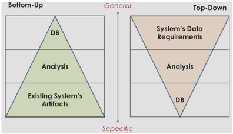
    
1. Top-Down
    
    Adalah pendekatan yang bergerak dari umum ke spesifik. Pendekatan ini baik digunakan untuk membuat model data pada 
    sistem yang sama sekali baru. Pada pendekatan ini, pengguna memberikan gambaran umum sistem dan data apa saja yang 
    perlu disimpan. Analis kemudian mendetailkan (dengan cara mewawancarai dan mengira-ngira) lebih lanjut tabel-tabel 
    dalam database berikut kolom-kolomnya.
        
1. Bottom-Up    

    Kebalikan dari metode sebelumnya, pada metode ini dilakukan penalaran yang bergerak dari spesifik ke umum. Pendekatan 
    ini memiliki kelebihan jika digunakan untuk membuat model data berdasarkan sistem yang sudah ada sebelumnya. Dalam 
    pendekatan ini pengguna menunjukkan sistem (dapat berupa sistem manual maupun yang sudah terkomputerisasi) yang saat 
    ini berjalan. Analis kemudian memeriksa semua dokumen, formulir, struk, laporan, buku kas, dll. yang terlibat dalam 
    sistem tersebut kemudian menyimpulkan database-nya.
    
### ERD Versi Martin
Selain ERD versi Chen, terdapat juga ERD versi martin yang tidak kalah populer. Pada ERD ini terdapat 5 macam relationship yaitu:

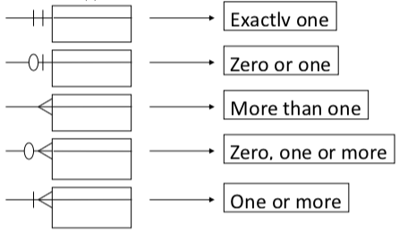

### CASE tools untuk membuat ERD
Untuk membuat ERD kita dapat memanfaatkan berbagai macam tools. Ada banyak tools yang dapat digunakan untuk membuat ERD 
dan tidak ada alasan mutlak untuk memilih tools tertentu diatas tools yang lain. Kita bebas menggunakan tools mana saja 
yang cocok untuk kebutuhan kita. Bahkan sebenarnya tidak ada keharusan untuk menggunakan tools, apabila mencukupi kita 
dapat membuat ERD pada kertas atau papan tulis.

Pada praktikum kali ini kita akan mencoba menggunakan salah satu tools untuk membuat ERD versi Chen. Tools tersebut 
bernama TerraEr. Tools tersebut dipilih karena lisensinya open source, ringan, dan mudah digunakan dimana saja selama ada 
JRE yang telah diinstal.

## Praktikum
1. Copy file [TerraER3.13.jar](TerraER3.13.jar) ke komputer Anda, untuk menjalankannya dalam komputer Anda harus sudah terinstall
Java Runtime Environment (JRE)
2. double klik file tersebut atau jalankan perintah `java -jar TerraER3.13.jar` sehingga dapat dilihat seperti pada tampilan
di bawah ini

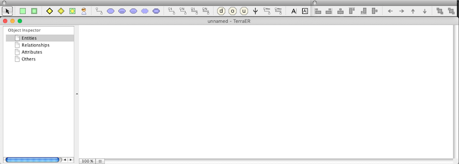

3. Untuk membuat ERD pada TerraEr, kita gunakan toolbar yang berada dibagian atas jendela aplikasi. Buat 1 entitas dengan 
cara Klik 1x pada ikon persegi berwarna hijau lalu klik 1x juga pada canvas(jendela utama aplikasi).

4. Untuk mengubah nama entitas, klik 2 kali pada simbol entitas. Beri nama entitas baru tersebut dengan nama `karyawan`.
    
    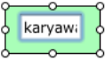
    
5. Tambahkan entitas lemah (weak entity) dengan cara yang sama seperti cara yang dilakukan untuk menambahkan entitas 
sebelumnya. Klik 2x dan berinama entitas tersebut dengan nama `tanggungan`

    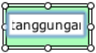
    
6. Tambahkan identifying relationship dengan cara menambahkan simbol berbentuk belah ketupat dengan garis tepi ganda.

    
    
7. Beri nama relationship tersebut dengan nama `memiliki`.  

    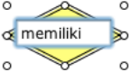
    
8. Untuk menambahkan properties/attributes, kita gunakan simbol-simbol elips pada bagian tengah panel atas.

    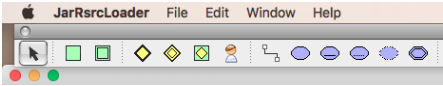
    
9. Untuk menghubungkan attribute dengan entitas atau relationship, kita gunakan `Attribute Connection` dengan mengklik 
1x ikon bergambar berikut:  

      
    
10. Lalu mengklik 1x pada atribut yang diinginkan kemudian di-drag ke entity atau relationship yang menjadi pemilik dari 
atribut tadi. Tambahkan 1 atribut kunci dan 1 atribut simple. Lalu hubungkan keduanya dengan entitas kuat karyawan yang 
telah kita buat sebelumnya.

    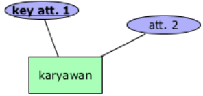

11. Tambahkan 1 partial key atribut dan 1 attribut simple pada weak entity tanggungan dengan cara yang sama seperti sebelumnya.

    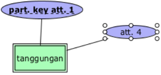

12. Untuk menghubungkan entity dengan relationship kita gunakan button-button yang ada di sebelah kanan panel atas. 
Ada 4 macam garis penghubung:
    - 1, untuk relationship 1 to....
    - N, untuk relationship many to....
    - 1=, total participation untuk entitas lemah dengan relationship 1 to....
    - N=, total participation untuk entitas lemah dengan relationship Many to....
    
    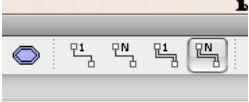
    
13. Hubungkan entitas lemah ‘tanggungan’ dengan relationship ‘memiliki’ menggunakan ‘total participation N’. Klik ikon 
di atas 1x, lalu klik entity ‘tanggungan’ dan drag ke arah relationship ‘memiliki’.

    

14. Dengan cara yang sama, klik penghubung biasa relationship ‘1 to...’ dan hubungkan entity ‘karyawan’ dengan 
relationship ‘memiliki’.

    

15. Beri nama semua atribut pada entitas-entitas yang ada sehingga menjadi seperti berikut:

    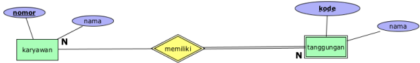

## Tugas
1. Simpanlah lagi ERD yang Anda buat tadi dengan nama lain. Lalu modifikasi dan lengkapilah ERD tersebut dengan semua 
elemen (Entities, Attributes, Relationships) yang terdapat dalam skenario Top-Down berikut:

    >Perusahaan konstruksi bernama PT. Maju Jaya ingin dibuatkan sistem informasi untuk mencatat data-data karyawannya. 
    Direksi memberikan arahan kepada analis bahwa pada sistem yang nantinya akan dibuat mereka butuhkan kemampuan untuk 
    menyimpan data karyawan berikut tanggungannya, data departemen, dan sekaligus data proyek.
    Pada Karyawan, selain Nomor Induk Karyawan (NIK), harus disimpan data-data tanggal lahir, umur, nama depan, nama tengah 
    dan belakang. Begitu juga dengan jenis kelamin, alamat, serta gaji per bulannya. Sedangkan untuk tanggungan, yang perlu 
    disimpan adalah tentu saja nama, jenis kelamin, tanggal lahir, umur, dan juga hubungannya dengan karyawan yang 
    menanggung (apakah dia Istri, suami atau anak dari penanggung?).
    
    >Seorang karyawan dapat memiliki 1 atau lebih tanggungan atau juga dapat tidak memiliki tanggungan sama sekali. 
    Sebagian dari karyawan-karyawan perusahaan tersebut menduduki jabatan supervisor yang tugasnya mengawasi kinerja 
    karyawan-karyawan lain yang berada dalam departemen yang sama. Supervisor-supervisor ini melapor kepada masing-masing 
    manajer di departemennya. Baik supervisor maupun manajer, keduanya juga merupakan karyawan, karena itu mereka juga 
    pasti memiliki NIK.
    
    >Pada perusahaan tersebut terdapat beberapa departemen yang masing-masing dipimpin oleh seorang manajer. Direksi 
    perusahaan menginginkan agar sistem dapat menyimpan informasi mengenai departemen-departemen yang meliputi nama 
    departemen, nomor departemen, nomor ekstensi telepon, jumlah karyawan yang bekerja di dalamnya, serta lokasi 
    kota sebuah departemen berada. Karena PT. Maju Jaya memiliki banyak cabang, departemen-departemennya bisa berada kota 
    yang berbeda-beda. Contohnya Departemen Pemasaran ada di Jakarta, dan Departemen Lapangan berada di Malang. Selain 
    dari itu semua, perlu juga disimpan informasi tentang kapan setiap manajer mulai menjabat di departemennya.
    Fungsi dari tiap departemen yang ada adalah untuk mengontrol proyek-proyek yang dikerjakan oleh PT. Maju Jaya. 
    Sebagai contoh, untuk proyek pembangunan jalan, jembatan dan sejenisnya, dikontrol oleh Departemen Pekerjaan Umum. 
    Untuk proyek semacam perbaikan taman kota dan tempat rekreasi, ditangani oleh Departemen Pertamanan dan Rekreasi. Dan 
    banyak lagi proyek-proyek lainnya. Satu departemen dapat mengontrol banyak proyek sekaligus. Namun satu proyek hanya 
    boleh ditangani oleh tepat 1 departemen saja.
    
    >Semua karyawan akan selalu ditugaskan ke satu atau lebih proyek tertentu, dan semua proyek pasti ada banyak karyawan 
    yang menangani. Data seputar proyek yang perlu disimpan meliputi nama proyek, lokasi, nomor proyek, dan jenis proyek. 
    Sementara untuk keperluan penggajian, perlu juga dicatat berapa total jam kerja yang dihabiskan oleh setiap karyawan 
    yang bekerja dalam suatu proyek.

2. Cari dan install CASE tools yang dapat digunakan untuk membuat ERD versi Martin. Software apapun boleh asalkan dengan 
syarat harus gratis (legal) atau open source. Mari kita hindari penggunaan perangkat lunak ilegal.
3. Gunakan tools yang telah Anda install tadi untuk membuat ERD versi Martin dari soal nomor 1.