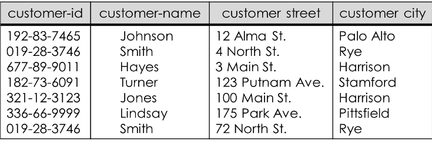
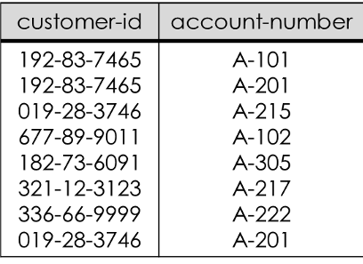

# Jobsheet Minggu-5: Pemetaan ERD Ke Model Relasional

## Topik
1. Model Relasional
2. Conceptual Data Model
3. Physical Data Model
4. Sybase Power Designer

## Tujuan
Mahasiswa diharapkan memperoleh pemahaman lebih lanjut mengenai basis data model relasional yang digambarkan dengan Conceptual Data Model (CDM) dan Physical Data Model (PDM) yang dibuat dengan Sybase Power Designer

## Pendahuluan
Komputer mempunyai fungsi utama untuk menyimpan dan mengelola informasi. Perlu dilakukan tata cara mengatur informasi tersebut cara yang sederhana dan memudahkan data untuk diakses dan dikelola. Model relasional digagas untuk mengorganisasi ke data ke dalam banyak tabel dua dimensi yang saling berelasi

### Sejarah
Model relasional pertama kali dikenalkan oleh Codd, pada tahun 1971. Sejak itu model relasi memainkan peranan yang sangat penting dalam berbagai perancangan basis data. Ada tiga alasan mengapa model relasi mempunyai peranan penting dalam perancangan basis data yaitu : 
+ Relasi merepresentasikan struktur data yang dapat dimengerti oleh user maupun designer 
+ Model relasional mendefinisikan salah satu kriteria perancangan basis data yang penting yaitu relasi bentuk normal
+ Struktur data yang direpresentasikan oleh relasi dapat segera dikonversikan & diimplementasikan ke RDBMS

Pada tahun 1985, Codd menerbitkan daftar 12 peraturan untuk mendefinisikan sistem basis data relasional, karena kekhawatiran bahwa banyak vendor memasarkan produk sebagai "relasional" walaupun produk tersebut tidak memenuhi standar relasional minimum.

Istilah pada Model Relasional
1. Relation/table/file  		: Representasi tabel yang terdiri dari sejumlah baris  dan kolom
2. Attribute/column/field	: Kolom pada tabel
3. Tuple/row/record		: Baris pada tabel
4. Domain			: Himpunan nilai dari satu atau lebih attribute
5. Degree				: Banyaknya attribute/kolom pada tabel
6. Cardinality			: Banyaknya tuple/baris pada tabel
7. Relational Basis Data		: Kumpulan relasi ternormalisasi dengan nama relasi yang jelas

| Istilah Formal       | Istilah Lain 1                     | Istilah Lain 2 |
|----------------------|------------------------------------|----------------|
| Relation             | Table                              | File           |
| Tuple                | Row                                | Record         |
| Attribute            | Column                             | Field          |

**Contoh Basis Data Model Relasional**

Tabel Customer

Tabel Account

Tabel Depositor

### Relasi Basis Data
Skema Relasi	merupakan nama relasi didefinisikan oleh himpunan pasangan atribut dan nama domain, sedangkan Skema Basis Data relasional merupakan  himpunan skema relasi dengan nama yang  berbeda.

### Sifat-sifat Relasi
Relasi dalam basis data model relasional memiliki sifat sebagai berikut :
+ Nama relasi berbeda satu sama lain dalam skema relasional
+ Setiap sel(baris,kolom) dari relasi berisi satu nilai atomik atau nilai tunggal
+ Setiap atribut memiliki nama yang berbeda
+ Nilai suatu atribut berasal dari domain yang sama
+ Setiap tuple adalah berbeda, dan tidak ada duplikasi tuple

**Relational Key**

Relational key dalam basis data model relasional terdiri dari:
+ **Superkey**

    Sebuah atribut (atau kombinasi atribut) secara unik mengenali setiap entitas dalam sebuah tabel.

+ **Candidate key**

    Sebuah superkey minimal, yaitu superkey yang tidak merupakan bagian atribut dari suatu superkey.

+ **Primary key**

    Candidate key yang terpilih untuk mengenali secara unik seluruh nilai atribut pada sebuah baris. Tidak boleh kosong.

+ **Secondary key**
    
    Sebuah atribut (atau kombinasi atribut) secara paksa digunakan untuk tujuan pengambilan data.

+ **Foreign key**
    
    Sebuah atribut (atau kombinasi atribut) dalam sebuah tabel dimana nilainya cocok dengan primary key pada tabel lainnya.

### Aturan-aturan Basis Data Model Relasional
Setiap himpunan entitas akan diimplementasikan sebagai sebuah tabel sesuai dengan ketentuan berikut;
1. Atribut multivalue

    Atribut bernilai banyak membuat sebuah tabel baru dengan mengambil kunci utama sebuah entitas
2. Derajat relasi 1-1
    
    Relasi one to one  menghubungkan 2 buah himpunan entitas, dipresentasikan dengan penambahan field relasi ke tabel yang mewakili salah satu dari kedua  himpunan entitas
3. Derajat relasi 1-N
    
    Relasi one to many yang menghubungkan 2 buah himpunan entitas, juga akan dipresentasikan dalam bentuk pemberian atribut key dari himpunan entitas pertama (berderajat 1) ke tabel yang mewakili himpunan entitas kedua (berderajat N). Atribut key dari himpunan entitas pertama ini menjadi atribut tambahan bagi himpunan entitas kedua.
4. Derajat Relasi N-N

    Relasi many to many yang menghubungkan 2 buah himpunan entitas, akan diwujdukan dalam betuk tabel  khusus yang memiliki field (foreign key) yang berasal dari key-key himpunan entitas yang dihubungkan.
5. Entitas Lemah

    Penggunaan Himpunan Entitas Lemah (Weak  Entity Sets) dan Sub-Entitas dalam Diagram E-R diterapkan dalam bentuk tabel sebagaimana Himpunan Entitas Kuat (Strong Entity Sets).

6. Relasi Tunggal(Unary)

    Penerapan Relasi Tunggal (Unary Relation) dari/ke himpunan entitas yang sama dalam Diagram E-R tergantung pada Derajat Relasinya. Unit Relasi Tunggal dengan Derajat Relasi satu-ke-banyak dapat diimplementasikan melalui penggunaan field key sebanyak dua kali lipat untuk fungsi yang berbeda.
7. Multi Entitas (n-ary)

    Relasi multi entitas menghubungkan lebih dari dua himpunan entitas, untuk itu akan diterapkan sebuah tabel khusus. Namun jika  dapat dipastikan bahwa hubungan antar entitas adalah 1-N maka cukup ditambahkan field pada entitas yang bersangkutan.

8. Relasi Ganda

    Relasi ganda diterapkan dengan cara yang sama dengan kardinalitasnya sesuai penjelasan sebelumnya.
9. Spesialisasi dan Generalisasi

    Generalisasi menyusutkan jumlah entitas,  sehingga hanya butuh satu entitas dengan panambahan field. Spesialisasi akan menghasilkan sejumlah himpunan entitas baru.

## Praktikum – Bagian 1: Membuat Tabel Deskripsi
1. Perhatikan dan pahami skenario berikut :
“Amazing course adalah sebuah tempat kursus komputer. Mereka yang ingin kursus komputer harus melakukan registrasi terlebih dahulu. Awalnya tempat kursus ini menggunakan sistem manual, namun karena banyaknya orang yang mendaftar maka dirancanglah sebuah database agar mempermudah kerja para pegawainya.

    Setiap orang yang akan mendaftar kursus harus melakukan pendaftaran sebagai anggota. Anggota memiliki informasi mengenai kode anggota, nama, alamat dan nomor telepon. Kode anggota terdiri dari 5 karakter (harus diawali dengan huruf ‘NT’ dan diikuti dengan 3 digit angka), selain itu nama anggota wajib diisi. Anggota dapat melakukan banyak pendaftaran secara sekaligus, dan setiap pendaftaran diwakili oleh setiap anggota atau salah satu anggota saja.  

    Proses pendaftaran akan melalui pemilihan jenis kursus. Informasi yang disimpan di dalam tabel kursus adalah kode kursus, nama kursus, dan biaya. Kode kursus terdiri dari 5 karakter (harus diawali dengan huruf ‘MK’ dan diikuti dengan 3 digit angka), selain itu nama jenis kursus wajib disimpan sebagai salah satu alternatif pilihan. Banyak pendaftaran dapat dilakukan di meja kasir secara sekaligus, dan kasir melayani setiap pendaftaran yang dilakukan. Di saat pendaftaran jenis kursus telah dilakukan maka jumlah pertemuan kursus akan diketahui.

    Setelah melakukan pemilihan kursus, maka proses pendaftaran dilanjutkan ke kasir. Kasir menyimpan informasi mengenai mengenai kode kasir, nama, alamat dan nomor telepon. Kode kasir terdiri dari 5 karakter (harus diawali dengan huruf ‘KY’ dan diikuti dengan 3 digit angka), selain itu nama petugas kasir juga wajib diisi. Sekali mendaftar beberapa kursus dapat dilakukan sekaligus, dan setiap jenis kursus diperoleh dari banyak proses pendaftaran”

2. Buatlah tabel deskripsi untuk tabel Anggota sesuai dengan skenario uji coba bagian 1 nomor 1!
    
    Tabel Anggota
    
    Primary key : kdAnggota

    | Nama Field         | Tipe Data                          | Length | Keterangan                                                                         |
    |--------------------|------------------------------------|--------|------------------------------------------------------------------------------------|
    | KdAnggota          | char                               | 5      | Harus diisi dan panjang=5, harus diawali dengan ‘NT’ dan 3 digit terakhirnya angka |
    | Nama               | varchar                            | 30     | Harus diisi                                                                        |
    | Alamat             | varchar                            | 50     | \-                                                                                 |
    | Telp               | integer                            | \-     | Panjangnya maksimal 10

3. Buatlah tabel deskripsi untuk tabel Kasir sesuai dengan skenario uji coba bagian 1 nomor 1!

    Tabel Kasir
    
    Primary key : kdKasir

| Nama Field         | Tipe Data                          | Length | Keterangan                                                                         |
|--------------------|------------------------------------|--------|------------------------------------------------------------------------------------|
| KdKasir            | char                               | 5      | Harus diisi dan panjang=5, harus diawali dengan ‘NT’ dan 3 digit terakhirnya angka |
| Nama               | varchar                            | 30     | Harus diisi                                                                        |
| Alamat             | varchar                            | 50     | \-                                                                                 |
| Telp               | integer                            | \-     | Panjangnya maksimal 10

4. Buatlah tabel deskripsi untuk tabel Kursus sesuai dengan skenario uji coba bagian 1 nomor 1!

    Tabel Kursus
    
    Primary key : kdKursus

| Nama Field         | Tipe Data                          | Length | Keterangan                                                                         |
|--------------------|------------------------------------|--------|------------------------------------------------------------------------------------|
| KdKursus           | char                               | 5      | Harus diisi dan panjang=5, harus diawali dengan ‘NT’ dan 3 digit terakhirnya angka |
| NamaKursus         | varchar                            | 30     | Harus diisi                                                                        |
| Biaya              | integer                            | \-     | Panjangnya maksimal 10

5. Buatlah tabel deskripsi untuk tabel HeaderPendaftaran sesuai dengan skenario uji coba bagian 1 nomor 1!
    
    Tabel HeaderPendaftaran
    
    Primary Key: kdPendaftaran
    
    Foreign key : kdAnggota, kdKasir

| Nama Field         | Tipe Data                          | Length | Keterangan                                                                         |
|--------------------|------------------------------------|--------|------------------------------------------------------------------------------------|
| KdPendaftaran      | char                               | 5      | Harus diisi dan panjang=5, harus diawali dengan ‘KP’ dan 3 digit terakhirnya angka |
| KdKasir            | char                               | 5      | \-                                                                                 |
| kdAnggota          | char                               | 5      | \-                                                                                 |
| TanggalPendaftaran | Datetime                           | \-     | \-  

6. Buatlah tabel deskripsi untuk tabel Detail Pendaftaran sesuai dengan skenario uji coba bagian 1 nomor 1!

    Tabel DetailPendaftaran

    Primary Key : kdKursus, kdPendaftaran

    Foreign Key : kdKursus, kdPendaftaran

| Nama Field         | Tipe Data                          | Length | Keterangan  |
|--------------------|------------------------------------|--------|-------------|
| kdKursus           | char                               | 5      | \-          |
| kdPendaftaran      | char                               | 5      | \-          |
| Jumlah Pertemuan   | integer                            | \-     | Harus diisi |

7. Lanjutkan praktikum ke praktikum-bagian 2!
