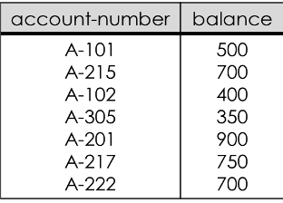
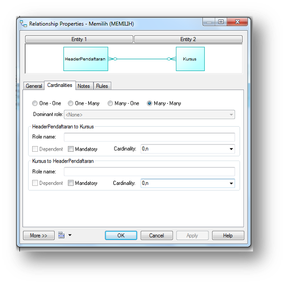
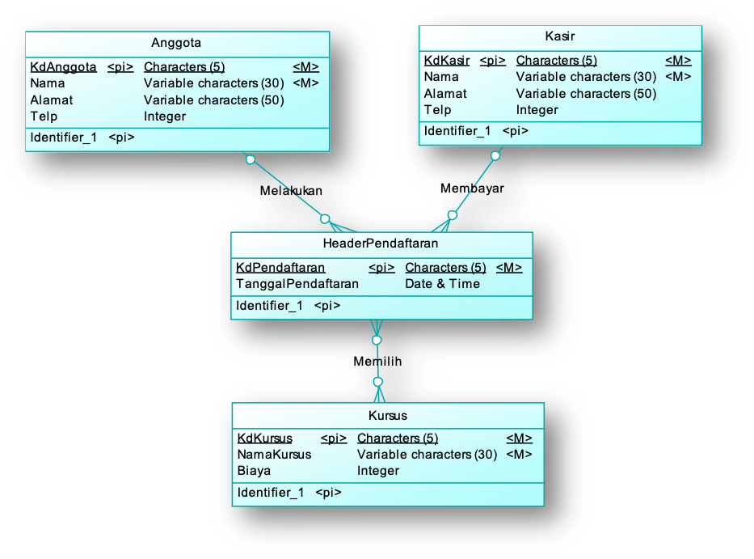
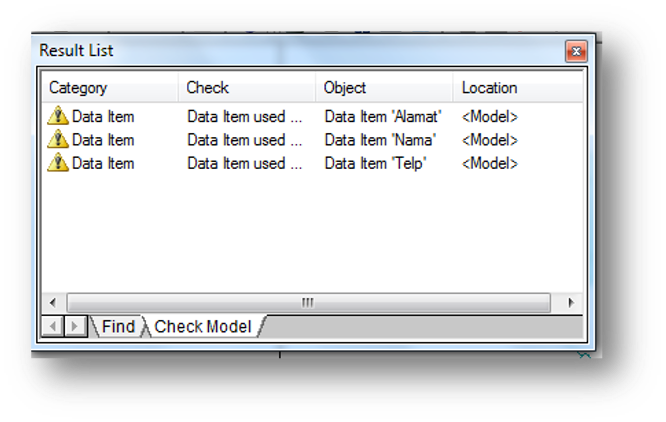
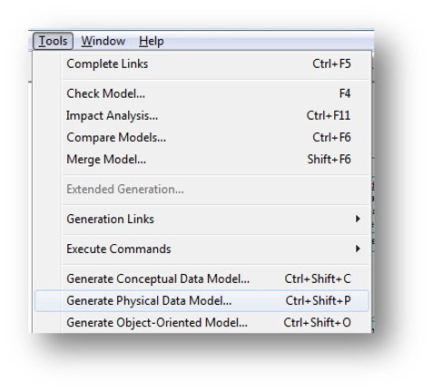
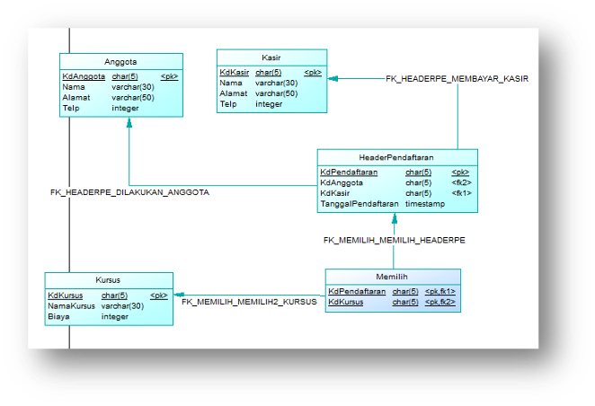

# Jobsheet Minggu-5: Pemetaan ERD Ke Model Relasional

## Topik
1. Model Relasional
2. Conceptual Data Model
3. Physical Data Model
4. Sybase Power Designer

## Tujuan
Mahasiswa diharapkan memperoleh pemahaman lebih lanjut mengenai basis data model relasional yang digambarkan dengan Conceptual Data Model (CDM) dan Physical Data Model (PDM) yang dibuat dengan Sybase Power Designer

## Pendahuluan
Komputer mempunyai fungsi utama untuk menyimpan dan mengelola informasi. Perlu dilakukan tata cara mengatur informasi tersebut cara yang sederhana dan memudahkan data untuk diakses dan dikelola. Model relasional digagas untuk mengorganisasi ke data ke dalam banyak tabel dua dimensi yang saling berelasi

### Sejarah
Model relasional pertama kali dikenalkan oleh Codd, pada tahun 1971. Sejak itu model relasi memainkan peranan yang sangat penting dalam berbagai perancangan basis data. Ada tiga alasan mengapa model relasi mempunyai peranan penting dalam perancangan basis data yaitu : 
+ Relasi merepresentasikan struktur data yang dapat dimengerti oleh user maupun designer 
+ Model relasional mendefinisikan salah satu kriteria perancangan basis data yang penting yaitu relasi bentuk normal
+ Struktur data yang direpresentasikan oleh relasi dapat segera dikonversikan & diimplementasikan ke RDBMS

Pada tahun 1985, Codd menerbitkan daftar 12 peraturan untuk mendefinisikan sistem basis data relasional, karena kekhawatiran bahwa banyak vendor memasarkan produk sebagai "relasional" walaupun produk tersebut tidak memenuhi standar relasional minimum.

Istilah pada Model Relasional
1. Relation/table/file  		: Representasi tabel yang terdiri dari sejumlah baris  dan kolom
2. Attribute/column/field	: Kolom pada tabel
3. Tuple/row/record		: Baris pada tabel
4. Domain			: Himpunan nilai dari satu atau lebih attribute
5. Degree				: Banyaknya attribute/kolom pada tabel
6. Cardinality			: Banyaknya tuple/baris pada tabel
7. Relational Basis Data		: Kumpulan relasi ternormalisasi dengan nama relasi yang jelas

| Istilah Formal       | Istilah Lain 1                     | Istilah Lain 2 |
|----------------------|------------------------------------|----------------|
| Relation             | Table                              | File           |
| Tuple                | Row                                | Record         |
| Attribute            | Column                             | Field          |

**Contoh Basis Data Model Relasional**

Tabel Customer

Tabel Account

Tabel Depositor

### Relasi Basis Data
Skema Relasi	merupakan nama relasi didefinisikan oleh himpunan pasangan atribut dan nama domain, sedangkan Skema Basis Data relasional merupakan  himpunan skema relasi dengan nama yang  berbeda.

### Sifat-sifat Relasi
Relasi dalam basis data model relasional memiliki sifat sebagai berikut :
+ Nama relasi berbeda satu sama lain dalam skema relasional
+ Setiap sel(baris,kolom) dari relasi berisi satu nilai atomik atau nilai tunggal
+ Setiap atribut memiliki nama yang berbeda
+ Nilai suatu atribut berasal dari domain yang sama
+ Setiap tuple adalah berbeda, dan tidak ada duplikasi tuple

**Relational Key**

Relational key dalam basis data model relasional terdiri dari:
+ **Superkey**

    Sebuah atribut (atau kombinasi atribut) secara unik mengenali setiap entitas dalam sebuah tabel.

+ **Candidate key**

    Sebuah superkey minimal, yaitu superkey yang tidak merupakan bagian atribut dari suatu superkey.

+ **Primary key**

    Candidate key yang terpilih untuk mengenali secara unik seluruh nilai atribut pada sebuah baris. Tidak boleh kosong.

+ **Secondary key**
    
    Sebuah atribut (atau kombinasi atribut) secara paksa digunakan untuk tujuan pengambilan data.

+ **Foreign key**
    
    Sebuah atribut (atau kombinasi atribut) dalam sebuah tabel dimana nilainya cocok dengan primary key pada tabel lainnya.

### Aturan-aturan Basis Data Model Relasional
Setiap himpunan entitas akan diimplementasikan sebagai sebuah tabel sesuai dengan ketentuan berikut;
1. Atribut multivalue

    Atribut bernilai banyak membuat sebuah tabel baru dengan mengambil kunci utama sebuah entitas
2. Derajat relasi 1-1
    
    Relasi one to one  menghubungkan 2 buah himpunan entitas, dipresentasikan dengan penambahan field relasi ke tabel yang mewakili salah satu dari kedua  himpunan entitas
3. Derajat relasi 1-N
    
    Relasi one to many yang menghubungkan 2 buah himpunan entitas, juga akan dipresentasikan dalam bentuk pemberian atribut key dari himpunan entitas pertama (berderajat 1) ke tabel yang mewakili himpunan entitas kedua (berderajat N). Atribut key dari himpunan entitas pertama ini menjadi atribut tambahan bagi himpunan entitas kedua.
4. Derajat Relasi N-N

    Relasi many to many yang menghubungkan 2 buah himpunan entitas, akan diwujdukan dalam betuk tabel  khusus yang memiliki field (foreign key) yang berasal dari key-key himpunan entitas yang dihubungkan.
5. Entitas Lemah

    Penggunaan Himpunan Entitas Lemah (Weak  Entity Sets) dan Sub-Entitas dalam Diagram E-R diterapkan dalam bentuk tabel sebagaimana Himpunan Entitas Kuat (Strong Entity Sets).

6. Relasi Tunggal(Unary)

    Penerapan Relasi Tunggal (Unary Relation) dari/ke himpunan entitas yang sama dalam Diagram E-R tergantung pada Derajat Relasinya. Unit Relasi Tunggal dengan Derajat Relasi satu-ke-banyak dapat diimplementasikan melalui penggunaan field key sebanyak dua kali lipat untuk fungsi yang berbeda.
7. Multi Entitas (n-ary)

    Relasi multi entitas menghubungkan lebih dari dua himpunan entitas, untuk itu akan diterapkan sebuah tabel khusus. Namun jika  dapat dipastikan bahwa hubungan antar entitas adalah 1-N maka cukup ditambahkan field pada entitas yang bersangkutan.

8. Relasi Ganda

    Relasi ganda diterapkan dengan cara yang sama dengan kardinalitasnya sesuai penjelasan sebelumnya.
9. Spesialisasi dan Generalisasi

    Generalisasi menyusutkan jumlah entitas,  sehingga hanya butuh satu entitas dengan panambahan field. Spesialisasi akan menghasilkan sejumlah himpunan entitas baru.

## Praktikum – Bagian 1: Membuat Tabel Deskripsi
1. Perhatikan dan pahami skenario berikut :
“Amazing course adalah sebuah tempat kursus komputer. Mereka yang ingin kursus komputer harus melakukan registrasi terlebih dahulu. Awalnya tempat kursus ini menggunakan sistem manual, namun karena banyaknya orang yang mendaftar maka dirancanglah sebuah database agar mempermudah kerja para pegawainya.

    Setiap orang yang akan mendaftar kursus harus melakukan pendaftaran sebagai anggota. Anggota memiliki informasi mengenai kode anggota, nama, alamat dan nomor telepon. Kode anggota terdiri dari 5 karakter (harus diawali dengan huruf ‘NT’ dan diikuti dengan 3 digit angka), selain itu nama anggota wajib diisi. Anggota dapat melakukan banyak pendaftaran secara sekaligus, dan setiap pendaftaran diwakili oleh setiap anggota atau salah satu anggota saja.  

    Proses pendaftaran akan melalui pemilihan jenis kursus. Informasi yang disimpan di dalam tabel kursus adalah kode kursus, nama kursus, dan biaya. Kode kursus terdiri dari 5 karakter (harus diawali dengan huruf ‘MK’ dan diikuti dengan 3 digit angka), selain itu nama jenis kursus wajib disimpan sebagai salah satu alternatif pilihan. Banyak pendaftaran dapat dilakukan di meja kasir secara sekaligus, dan kasir melayani setiap pendaftaran yang dilakukan. Di saat pendaftaran jenis kursus telah dilakukan maka jumlah pertemuan kursus akan diketahui.

    Setelah melakukan pemilihan kursus, maka proses pendaftaran dilanjutkan ke kasir. Kasir menyimpan informasi mengenai mengenai kode kasir, nama, alamat dan nomor telepon. Kode kasir terdiri dari 5 karakter (harus diawali dengan huruf ‘KY’ dan diikuti dengan 3 digit angka), selain itu nama petugas kasir juga wajib diisi. Sekali mendaftar beberapa kursus dapat dilakukan sekaligus, dan setiap jenis kursus diperoleh dari banyak proses pendaftaran”

2. Buatlah tabel deskripsi untuk **tabel Anggota** sesuai dengan skenario uji coba bagian 1 nomor 1!
    
    Tabel Anggota
    
    Primary key : kdAnggota

    <table>
    <tr>
        <td>Nama Field</td>
        <td>Tipe Data</td>
        <td>Length</td>
        <td>Keterangan</td>
    </tr>
    <tr>
        <td>KdAnggota</td>
        <td>char</td>
        <td>5</td>
        <td>Harus diisi dan panjang=5, harus diawali dengan ‘NT’ dan 3 digit terakhirnya angka</td>
    </tr>
    <tr>
        <td>Nama</td>
        <td>varchar</td>
        <td>30</td>
        <td>Harus diisi</td>
    </tr>
    <tr>
        <td>Alamat</td>
        <td>varchar</td>
        <td>50</td>
        <td>-</td>
    </tr>
    <tr>
        <td>Telp</td>
        <td>integer</td>
        <td>-</td>
        <td>Panjangnya maksimal 10</td>
    </tr>
    </table>

3. Buatlah tabel deskripsi untuk **tabel Kasir** sesuai dengan skenario uji coba bagian 1 nomor 1!

    Tabel Kasir
    
    Primary key : kdKasir

    <table>
    <tr>
        <td>Nama Field</td>
        <td>Tipe Data</td>
        <td>Length</td>
        <td>Keterangan</td>
    </tr>
    <tr>
        <td>KdKasir</td>
        <td>char</td>
        <td>5</td>
        <td>Harus diisi dan panjang=5, harus diawali dengan ‘KY’ dan 3 digit terakhirnya angka</td>
    </tr>
    <tr>
        <td>Nama</td>
        <td>varchar</td>
        <td>30</td>
        <td>Harus diisi</td>
    </tr>
    <tr>
        <td>Alamat</td>
        <td>varchar</td>
        <td>50</td>
        <td>-</td>
    </tr>
    <tr>
        <td>Telp</td>
        <td>integer</td>
        <td>-</td>
        <td>Panjangnya maksimal 10</td>
    </tr>
    </table>

4. Buatlah tabel deskripsi untuk **tabel Kursus** sesuai dengan skenario uji coba bagian 1 nomor 1!

    Tabel Kursus
    
    Primary key : kdKursus

    <table>
    <tr>
        <td>Nama Field</td>
        <td>Tipe Data</td>
        <td>Length</td>
        <td>Keterangan</td>
    </tr>
    <tr>
        <td>KdKursus</td>
        <td>char</td>
        <td>5</td>
        <td>Harus diisi dan panjang=5, harus diawali dengan ‘MK’ dan 3 digit terakhirnya angka</td>
    </tr>
    <tr>
        <td>NamaKursus</td>
        <td>varchar</td>
        <td>30</td>
        <td>Harus diisi</td>
    </tr>
    <tr>
        <td>Biaya</td>
        <td>integer</td>
        <td>-</td>
        <td>-</td>
    </tr>
    </table>

5. Buatlah tabel deskripsi untuk **tabel HeaderPendaftaran** sesuai dengan skenario uji coba bagian 1 nomor 1!
    
    Tabel HeaderPendaftaran
    
    Primary Key: kdPendaftaran
    
    Foreign key : kdAnggota, kdKasir

    <table>
    <tr>
        <td>Nama Field</td>
        <td>Tipe Data</td>
        <td>Length</td>
        <td>Keterangan</td>
    </tr>
    <tr>
        <td>KdPendaftaran</td>
        <td>char</td>
        <td>5</td>
        <td>Harus diisi dan panjang=5, harus diawali dengan ‘KP’ dan 3 digit terakhirnya angka</td>
    </tr>
    <tr>
        <td>KdKasir</td>
        <td>char</td>
        <td>5</td>
        <td>-</td>
    </tr>
    <tr>
        <td>kdAnggota</td>
        <td>char</td>
        <td>5</td>
        <td>-</td>
    </tr>
    <tr>
        <td>TanggalPendaftaran</td>
        <td>Datetime</td>
        <td>-</td>
        <td>-</td>
    </tr>
    </table>

6. Buatlah tabel deskripsi untuk **tabel Detail Pendaftaran** sesuai dengan skenario uji coba bagian 1 nomor 1!

    Tabel DetailPendaftaran

    Primary Key : kdKursus, kdPendaftaran

    Foreign Key : kdKursus, kdPendaftaran

    <table>
    <tr>
        <td>Nama Field</td>
        <td>Tipe Data</td>
        <td>Length</td>
        <td>Keterangan</td>
    </tr>
    <tr>
        <td>kdKursus</td>
        <td>char</td>
        <td>5</td>
        <td>-</td>
    </tr>
    <tr>
        <td>kdPendaftaran</td>
        <td>char</td>
        <td>5</td>
        <td>-</td>
    </tr>
    <tr>
        <td>Jumlah Pertemuan</td>
        <td>integer</td>
        <td>-</td>
        <td>Harus diisi</td>
    </tr>
    </table>

7. Lanjutkan praktikum ke praktikum-bagian 2!

## Praktikum – Bagian 2: Membuat CDM
1. Bukalah file PowerDesigner.exe pada folder PowerDesigner (Sybase Power Designer versi 12.5 portable) untuk mulai membuat CDM!
    > Silakan download di [sini](https://drive.google.com/open?id=1jKlvNzMSncLoz60jjnFoY0dsT6vIqxsM) untuk master Power Desginer.
    
    

2. Kemudian klik menu ‘new’ di kiri atas untuk mulai membuat CDM. Selanjutnya akan muncul gambar seperti ini:
    
    
    
    Pilih model type ‘Conceptual Data Model’ dan di tab ‘General’ sebelah kanan, isikan model name dengan ‘Amazing_Course’ dan klik button ‘OK’!
3. Buatlah entitas dengan memilih menu ‘Palette’!
    
    

4. Double klik pada setiap entitas dan isikan atribut sesuai dengan tabel deskripsi! 
Lakukan tahap ini untuk tabel Anggota, Kasir, Kursus dan HeaderPendaftaran!
Setelah mengisikan ‘Name’, ‘Data_Type’, dan ‘Length’ centang pilihan ‘M’ untuk mandatory, ‘P’ untuk primary key!
    
    

5. Buatlah relasi  dengan memilih menu ‘Palette’!

    

6. Double klik pada relasi untuk mengganti cardinalitas ataupun merubah nama sesuai tampilan berikut!

    

7. Pastikan CDM sudah sesuai dengan gambar di bawah ini!

    

8. Lanjutkan praktikum ke **praktikum-bagian 3!**

## Praktikum – Bagian 3: Membuat PDM
1. Sebelum melanjutkan ke praktikum bagian 3 pastikan CDM yang telah Anda buat sudah benar dengan cara memilih menu ‘Tools’ dan pilih ‘Check Model’, kemudian klik ‘OK’

    

    Setelah ‘OK’ akan muncul tampilan untuk memastikan ada error atau warning seperti gambar di bawah ini:

    

2. PDM akan dibuat dengan cara generate CDM. Pilih menu ‘Tools’ dan pilih ‘Generating Physical Data Model’

    

3. Pastikan PDM yang telah Anda generate sudah sesuai dengan tampilan berikut :

    

4. Ubahlah nama tabel baru hasil generate kardinalitas many to many antara tabel Kursus dengan HeaderPendaftaran menjadi Detail_Pendaftaran dan tambahkan atribut ‘JumlahPertemuan’ sesuai dengan skenario. Lakukan perubahan dengan cara double klik pada tabel Memilih

    

5. Pastikan kembali PDM Anda sudah sesuai dengan PDM berikut:

    

6. Lanjutkan praktikum ke bagian *Tugas!*

## Tugas
1. Buatlah CDM dan PDM untuk skenario berikut dengan terlebih dahulu membuat relational key yang terdiri dari nama relasi, superkey, candidate key, primary key, foreign key, dan alternate key.
“Salah satu toko boneka di Malang ingin merubah sistem penjualan yang awalnya manual menjadi otomatis. Oleh karena itu dibutuhkan peracangan basis data dengan memperhatikan proses bisnis dan objek yang terlibat dalam kegiatan jual bali di toko boneka tersebut. Terdapat beberapa ketentuan di toko tersebut sebagai berikut:
    1. Member memiliki salah satu jenis member
    2. Member dapat melakukan pembelian sebanyak mungkin selama membutuhkan. Dan setiap transaksi penjualan dilakukan oleh setiap member secara bergantian
    3. Pegawai dapat melayani banyak transaksi penjualan dalam sehari
    4. Setiap hari banyak boneka yang terjual, dan sekali transaksi penjualan dapat terdiri dari beberapa boneka secara sekaligus”

    Selain informasi mengenai ketentuan toko boneka tersebut ditentukan juga informasi mengenai objek beserta atribut-atributnya sesuai dengan tabel-tabel di bawah ini:

    Tabel JenisMember

    Primary key : KdJenisMember

    <table>
    <tr>
        <td>Nama Field</td>
        <td>Tipe Data</td>
        <td>Length</td>
        <td>Keterangan</td>
    </tr>
    <tr>
        <td>KdJenisMember</td>
        <td>char</td>
        <td>5</td>
        <td>Harus diisi dan panjang=5, harus diawali dengan ‘JM’ dan 3 digit terakhirnya angka</td>
    </tr>
    <tr>
        <td>JenisMember</td>
        <td>varchar</td>
        <td>10</td>
        <td>Harus diisi</td>
    </tr>
    <tr>
        <td>Disc</td>
        <td>Decimal</td>
        <td>(2,2)</td>
        <td>-</td>
    </tr>
    </table>
    
    Tabel Member

    Primary key : KdMember
    Foreign Key : KdJenisMember

    <table>
    <tr>
        <td>Nama Field</td>
        <td>Tipe Data</td>
        <td>Length</td>
        <td>Keterangan</td>
    </tr>
    <tr>
        <td>KdMember</td>
        <td>char</td>
        <td>5</td>
        <td>Harus diisi dan panjang=5, harus diawali dengan ‘NM’ dan 3 digit terakhirnya angka</td>
    </tr>
    <tr>
        <td>KdJenisMember</td>
        <td>char</td>
        <td>5</td>
        <td>-</td>
    </tr>
    <tr>
        <td>NamaMember</td>
        <td>varchar</td>
        <td>50</td>
        <td>Harus diisi</td>
    </tr>
    <tr>
        <td>TelpMember</td>
        <td>integer</td>
        <td>-</td>
        <td>Panjangnya maksimal 10</td>
    </tr>
    </table>

    Tabel HeaderPenjualan
Primary key : KdPenjualan
Foreign Key : KdMember, KdPegawai

    <table>
    <tr>
        <td>Nama Field</td>
        <td>Tipe Data</td>
        <td>Length</td>
        <td>Keterangan</td>
    </tr>
    <tr>
        <td>KdPenjualan</td>
        <td>char</td>
        <td>5</td>
        <td>Harus diisi dan panjang=5, harus diawali dengan ‘KP’ dan 3 digit terakhirnya angka</td>
    </tr>
    <tr>
        <td>KdMember</td>
        <td>char</td>
        <td>5</td>
        <td>-</td>
    </tr>
    <tr>
        <td>KdPegawai</td>
        <td>char</td>
        <td>5</td>
        <td>-</td>
    </tr>
    <tr>
        <td>TglPenjualan</td>
        <td>datetime</td>
        <td>-</td>
        <td>Harus disi</td>
    </tr>
    </table>

    Tabel Pegawai

    Primary key : KdPegawai

    <table>
    <tr>
        <td>Nama Field</td>
        <td>Tipe Data</td>
        <td>Length</td>
        <td>Keterangan</td>
    </tr>
    <tr>
        <td>KdPegawai</td>
        <td>char</td>
        <td>5</td>
        <td>Harus diisi dan panjang=5, harus diawali dengan ‘KG’ dan 3 digit terakhirnya angka</td>
    </tr>
    <tr>
        <td>NamaPegawai</td>
        <td>varchar</td>
        <td>30</td>
        <td>Harus diisi</td>
    </tr>
    <tr>
        <td>AlamatPegawai</td>
        <td>varchar</td>
        <td>50</td>
        <td>-</td>
    </tr>
    <tr>
        <td>TelpPegawai</td>
        <td>integer</td>
        <td>-</td>
        <td>Panjangnya maksimal 10</td>
    </tr>
    </table>

    Tabel Boneka

    Primary key : KdBoneka

    <table>
    <tr>
        <td>Nama Field</td>
        <td>Tipe Data</td>
        <td>Length</td>
        <td>Keterangan</td>
    </tr>
    <tr>
        <td>KdBoneka</td>
        <td>char</td>
        <td>5</td>
        <td>Harus diisi dan panjang=5, harus diawali dengan ‘KB’ dan 3 digit terakhirnya angka</td>
    </tr>
    <tr>
        <td>NamaBoneka</td>
        <td>varchar</td>
        <td>30</td>
        <td>Harus diisi</td>
    </tr>
    <tr>
        <td>Harga</td>
        <td>integer</td>
        <td>-</td>
        <td>Harus diisi, panjang maksimal 10</td>
    </tr>
    <tr>
        <td>Stock</td>
        <td>integer</td>
        <td>-</td>
        <td>Harus diisi, panjangnya maksimal 10</td>
    </tr>
    </table>

    Tabel DetilPenjualan

    Primary key : KdPenjualan, KdBoneka

    Foreign Key : KdPenjualan, KdBoneka

    <table>
    <tr>
        <td>Nama Field</td>
        <td>Tipe Data</td>
        <td>Length</td>
        <td>Keterangan</td>
    </tr>
    <tr>
        <td>KdPenjualan</td>
        <td>char</td>
        <td>5</td>
        <td>-</td>
    </tr>
    <tr>
        <td>KdBoneka</td>
        <td>char</td>
        <td>5</td>
        <td>-</td>
    </tr>
    <tr>
        <td>Qty</td>
        <td>integer</td>
        <td>5</td>
        <td>Harus diisi</td>
    </tr>
    </table>

2. Buatlah tabel deskripsi, CDM dan PDM untuk skenario berikut:

    “Salah satu restaurant terbesar di Indonesia ingin memperbaiki sistem booking yang dulunya manual menjadi otomatis. Untuk itu diperlukan perncangan basis data sesuai dengan kebutuhan dan sistem yang ada di restaurant tersebut.

    Konsumen 		: kode konsumen, nama awal, nama akhir, no telepon, email, dan 
    keterangan.

    Booking 		: kode booking, dan tanggal

    Meja 			: no meja dan detil meja

    Pesanan 		: kode pesan, dan tanggal

    Staf 			: kode staf, nama awal, nama akhir

    Peranan		: kode peranan, nama peranan

    Menu pesanan 	: kode menu pesanan, kuantitas, komen

    Menu			: kode menu, tanggal

    Item menu		: kode item menu, keterangan, harga

    Bahan			: kode bahan, nama bahan

    Item bahan		: kode item bahan dan kuantitas

    Tipe bahan		: kode tipe bahan dan deskripsi

    Terdapat beberapa aturan dalam proses pemesanan di restaurant tersebut. Mulai dari setiap konsumen dapat melakukan banyak booking atau tidak sama sekali, setiap meja dapat dibooking oleh banyak konsumen atau tidak sama sekali. Setelah mendapatkan meja pemesanan dapat dilakukan atau tidak jadi dilakukan. Setiap pesanan dilakukan hanya pada satu meja, dan setiap staf dapat melayani banyak pesanan dalam suatu waktu atau tidak sama sekali. Staf yang melayani konsumen pasti memiliki peranan tertetu. Pemesanan dapat memesan banyak menu pesanan atau tidak sama sekali (dalam artian hanya meminjam meja saja tetapi menu dari luar). Setiap item menu terdapat dalam banyak menu pesanan atau tidak sama sekali. Item menu dapat tertulis atau tidak tertulis di dalam menu yang disediakan. Item menu yang ada terdiri dari banyak Item bahan atau bahkan tidak tertulis di dalam item bahan. Semua bahan yang digunakan dalam item bahan tersimpan di dalam informasi bahan, tetapi belum tentu sebaliknya. Ternyata bahan tersebut memiliki tipe bahan yang bisa jadi sama antara satu bahan dengan bahan yang lain atau bahkan tidak ada di dalam bahan yang tersedia”

3. Buatlah tabel deskripsi, CDM dan PDM untuk skenario berikut :

    Sebuah kampus memiliki fasilitas-fasilitas seperti lapangan futsal, lapangan basket, lapangan badminton, lapangan voli, dan stadion sepakbola. Penggunaan fasilitas-fasilitas tersebut harus dengan melakukan penyewaan yang dapat dilakukan oleh masyarakat secara umum dan warga kampus (mahasiswa, dosen, karyawan). 

    Jika ingin melakukan penyewaan, orang umum diharuskan melakukan registrasi menjadi member pada kantor bagian fasilitas umum, warga kampus tidak perlu melakukan registrasi, cukup menunjukkan kartu identitas saja. Data member terdiri dari kode member, nomor identitas, nama, alamat, dan nomor telepon. Data mahasiswa terdiri dari NIM, nama mahasiswa, alamat, dan nomor telepon. Untuk data dosen dan karyawan terdiri dari NIP, nama, alamat, dan nomor telepon. Seorang member maupun warga kampus dapat melakukan penyewaan fasilitas kampus lebih dari satu kali, begitu pula sebuah fasilitas kampus dapat disewa lebih dari satu kali.
    Ketika yang melakukan penyewaan adalah seorang warga kampus, dapat diketahui data mahasiswa atau dosen dari prodi, jurusan, dan fakultas tertentu. Sebuah fakultas dapat memiliki beberapa jurusan, sebuah jurusan dapat memiliki beberapa prodi. Seorang mahasiswa dan dosen hanya berada pada sebuah prodi.

    Transaksi penyewaan fasilitas kampus menyimpan data tanggal transaksi, nominal transaksi, dan durasi penyewaan. Terdapat diskon 15 persen bagi penyewa warga kampus. Setiap transaksi dilayani oleh seorang pegawai, sehingga data NIP dan nama seorang pegawai juga direkam dalam setiap aktivitas transaksi penyewaan fasilitas kampus.  

Praktikum dan tugas dikumpulkan dalam sebuah laporan yang berisi deskripsi tabel, cdm, dan pdm. Tidak perlu menyertakan file asli cdm dan pdm. Kumpulkan dalam format dokumen pdf. 

## Daftar Pustaka
1. Dwi Puspitasari, S.Kom, “Buku Ajar Dasar Basis Data”, Program Studi Manajemen Informatika Politeknik Negeri Malang, 2012.
2. indrajani.  Pengantar Sistem Basis Data Case Study All in One. Elex Media Komputindo. 2014
3. Fathansyah, “Basisdata Revisi Kedua”, Bandung: Informatika, 2015.
4. http://www.dcs.warwick.ac.uk/~hugh/TTM/The-Relational-Model.pdf
5. http://infolab.stanford.edu/~ullman/focs/ch08.pdf
6. http://www.inf.unibz.it/~nutt/IDBs1011/IDBSlides/5-db-erToRel.pdf
7. http://teknikinformatika.fasilkom.mercubuana.ac.id/wp-content/uploads/2015/03/3.-Modul-3-Model-Data-Relasional.pdf
8. http://www.databaseanswers.org