# Jobsheet Minggu ke-6: Pemetaan ERD ke Model Relasional(2)

## Topik
Model Relasional (2)

## Tujuan
Mahasiswa diharapkan dapat memahami tentang model relasional

## Pendahuluan
Model relasional pertama kali diperkenalkan oleh E.F. Codd pada tahun 1970. Objektifitas dari model relasional ini adalah konsep kemandirian data, relasi yang normal tanpa adanya kelompok pengulangan serta perluasan dari bahasa manipulasi data yang berorientasi pada himpunan data.

Model Data Relasional adalah suatu model basis data yang menggunakan tabel dua dimensi, yang terdiri atas baris dan kolom untuk menggambarkan sebuah berkas data. Model ini menunjukkan cara mengelola/mengorganisasikan data secara fisik dalam memory sekunder, yang akan berdampak pula pada bagaimana kita mengelompokkan data dan membentuk keseluruhan
data yang terkait dalam sistem yang kita buat.

Contoh Tabel dan keterhubungannya :

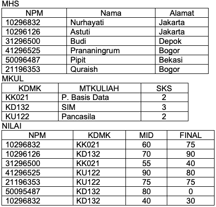

Keuntungan Model Data Relasional
1. Bentuknya sederhana
2. Mudah melakukan berbagai operasi data (query, update/edit, delete).

Contoh-contoh model basis data:
1. Model basis data hirarki
2. Model basis data network/jaringan
3. Model basis data relational (paling banyak digunakan)

Contoh DBMS yang mengelola basis data relational :
- dBase III+
- MS.Access
- Borland-Paradox
- Oracle
- DB2
- SYBASE
- Informix

Contoh Pembuatan Tabel.

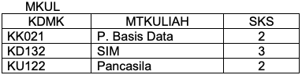

Karakteristik dari tabel MKUL:
- data mata kuliah memiliki 3 buah kolom data
- kolom 1 berisi adta string/alphanumerik dengan lebar tetap, yaitu 5 digit/char.
- Kolom 2 berisi data string dengan lebar maksimum 30 digit.
- Kolom 3 berisi data integer dengan lebar maksimum 1 digit.

Dari karakteristik di atas, kita bisa menetapkan struktur data tabel MKUL:
- nama kolom/field.
- Tipe data.
- Lebar (banyaknya digit maksimum yang bisa ditampung).

Jadi, struktur tabel MKUL:
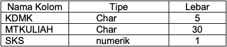

Istilah dalam Model Data Relasional:
+ Relasi: Sebuah tabel yang terdiri dari beberapa kolom dan beberapa baris.
Atribut:Kolom pada sebuah relasi (field).
+ Tupel: Baris pada sebuah relasi (record).
Domain: Kumpulan nilai yang valid untuk satu atau lebih atribut
+ Derajat (degree): Jumlah atribut dalam sebuah relasi (jumlah field)
+ Cardinality: Jumlah tupel dalam sebuah relasi (jumlah record)

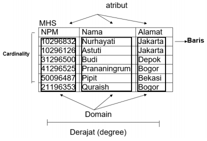

Relational Key

Super key

Satu atribut/kumpulan atribut yang secara unik mengidentifikasi sebuah tupel di
dalam relasi (satu atau lebih field yang dapat dipilih untuk membedakan antara 1 record
dengan record lainnya).
Contoh: Untuk tabel MHS di atas, super key-nya:
- NPM
- NAMA (dengan syarat tidak ada nama yang sama)
- ALAMAT (dengan syarat tidak ada alamat yang sama)
- NPM + NAMA
- NPM + ALAMAT
- NAMA + ALAMAT
- NPM + NAMA + ALAMAT

Candidate key

Atribut di dalam relasi yang biasanya mempunyai nilai unik (super key dengan jumlah field
yang paling sedikit)
Maka, candidate key-nya adalah NPM, NAMA dan ALAMAT (karena hanya terdiri dari 1
field saja)

Primary key

Candidate key yang dipilih untuk mengidentifikasikan tupel secara unik dalam relasi
Maka, primary key yang dipilih adalah NPM (unik, tidak ada NPM yang sama).

Alternate key

Candidate key yang tidak dipilih sebagai primary key
Maka, candidate key-nya NAMA dan ALAMAT

Foreign key

Atribut dengan domain yang sama yang menjadi kunci utama pada sebuah relasi tetapi
pada relasi lain atribut tersebut hanya sebagai atribut biasa

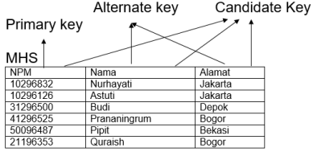

+ Relational Integrity Rules
1. Null

    Nilai suatu atribut yang tidak diketahui dan tidak cocok untuk baris (tuple) tersebut

2. Entity Integrity
    
    Tidak ada satu komponen primary key yang bernilai null.

3. Referential Integrity
    Suatu domain dapat dipakai sebagai kunci primer bila merupakan atribut tunggal pada domain yang bersangkutan.

+ Pemetaan ERD pada tabel
Aturan umum dalam pemetaan model data yang digambarkan dalam ERD (level konseptual)
menjadi tabel adalah :

a. Setiap himpunan entitas akan diimplementasikan sebagai sebuah tabel (file data)

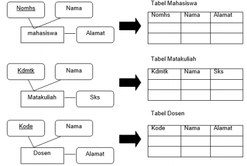

b. Relasi dengan derajat relasi satu-ke-satu, yang menghubungkan 2 buah himpunan
entitas akan direpresentasikan dalam bentuk penambahan / penyertaan atribut-atribut
relasi ke tabel yang mewakili salah satu dari kedua himpunan entitas

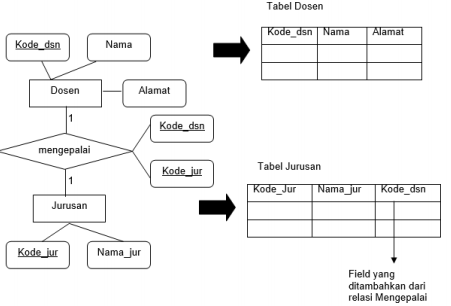

c. Relasi dengan derajat relasi satu-ke-banyak, yang menghubungkan 2 buah himpunan
entitas, juga akan direpresentasikan dalam bentuk pemberian / pencantuman atribut
kunci dari himpunan entitas pertama (yang berderajat 1) ke tabel yang mewakili
himpunan entitas kedua (yang berderajat M).

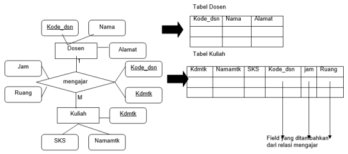

Pemetaan ERD pada bentu relasional
Berikut ini adalah contoh bentuk ERD pada suatu data perusahaan.

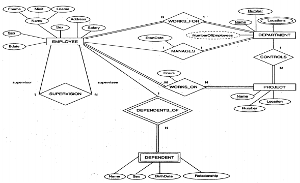

Kemudian dipetakan menjadi bentuk relasi

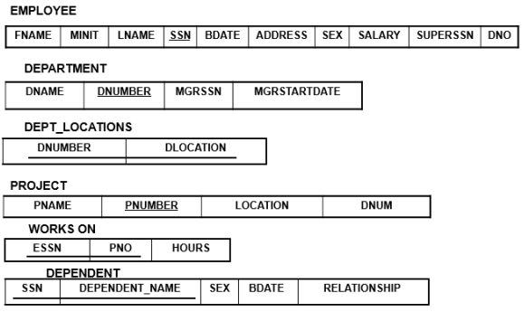

Mapping Skema ER Diagram dengan Referential Integrity Constraint. Referential Integrity
adalah sebuah cara untuk menjaga konsistensi data antara tabel yang saling ber-Relasi.

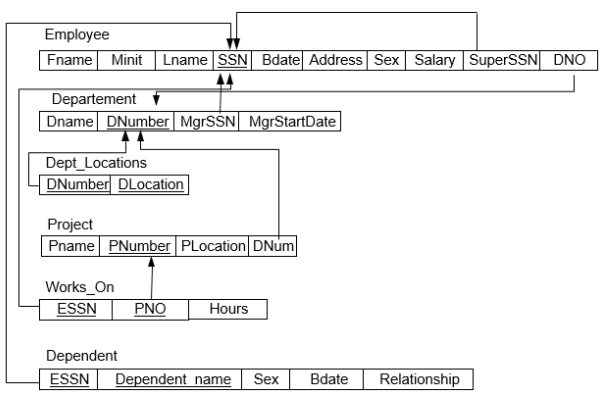

## Tugas Praktikum
1. Buat ERD dan model relasional untuk basis data “Peminjaman dan Pengembalian” pada perpustakaan umum, berdasarkan ketentuan berikut ini:

    a. Dalam basis data peminjaman dan pengembalian perlu dicatat data buku, anggota, kategori buku, peminjaman, serta pengembalian.

    b. Data buku yang perlu dicatat adalah kode buku yang unik, judul, pengarang, penerbit, tahun terbit, kategori buku, jumlah.
    
    c. Data anggota yang perlu dicatat adalah no anggota dan nama yang unik, alamat, no telepon, no ktp/no siswa, jenis kelamin, dan keterangan.
    
    d. Kategori buku yang perlu dicatat adalah kode dan keterangan yang menunjukkan kategori dari buku. Satu kategori buku bisa banyak buku, sedangkan satu buku hanya memiliki satu kategori, misalnya kategori ‘buku pelajaran’ bisa terdapat buku ‘basis data’, ‘matematika’, ‘bahasa inggris’, dll.
    
    e. Data peminjaman yang perlu dicatat adalah no peminjaman, tgl peminjaman, tgl harus kembali, dan jumlah buku yang dipinjam. Satu peminjaman bisa meminjam banyak buku, sehingga dalam peminjaman perlu dicatat daftar buku yang dipinjam.
    
    f. Data pengembalian perlu dicatat tanggal kembali dan buku yang dikembalikan. Pengembalian mengacu pada peminjaman. Satu peminjaman bisa banyak pengembalian.

2. Buat ERD dan model relasional untuk studi kasus berikut:

    Polinema ingin membuat sebuah sistem yang melayani penyewaan fasilitas olahraga. Diketahui fasilitas olahraga yang disediakan adalah beberapa lapangan dengan tiap lapangannya memiliki beberapa properti, misalnya bola dan gawang di lapangan futsal atau net di lapangan bulutangkis. Fasilitas Olahraga ini bisa disewa baik oleh civitas akademika maupun masyarakat umum.

    Proses Penyewaan memiliki beberapa tahapan. Pertama, si penyewa diharuskan registrasi terlebih dahulu. Registrasi yang dimaksud adalah menuliskan data - data diri si penyewa sebelum melakukan penyewaan. Setelah melakukan registrasi, si penyewa akan mendapat nomor id untuk melakukan reservasi. Pada saat reservasi, penyewa akan menentukan lapangan yang akan di sewa, tanggal menyewa, jam mulai menyewa serta jam akhir menyewa. Setelah penyewa memilih, petugas unit pengelola fasilitas olahraga akan mengecek apakah lapangan yang dipilih sudah disewa orang lain atau belum. Petugas unit pengelola fasilitas olahraga yang melayani proses reservasi maupun registrasi penyewa ada lah petugas yang sudah terdaftar dalam sistem. Jika sudah disewa maka petugas akan memberitahukan kepada penyewa bahwa ia tidak bisa melakukan penyewaan pada jam tersebut. Jika belum, maka penyewa dapat melakukan penyewaan lapangan yang dipilih. Penyewa diharuskan meninggalkan tanda pengenal saat melakukan penyewaan sebagai jaminan. 
    
    Untuk penyewaan lapangan, dikenakan biaya sesuai dengan lapangan yang disewa. Harga sewa pada siang hari dan harga sewa pada malam hari memiliki perbedaan. Malam hari lebih mahal dibandingkan siang hari. Biaya sewa akan dibayar setelah jam untuk menyewa telah habis. Jika penyewa sudah membayar, barulah petugas mengembalikan tanda pengenal penyewa yang dipakai sebagai jaminan di awal penyewaan. Setiap penyewa dapat melakukan penyewaan lebih dari satu kali.

## Daftar Pustaka
+ Dwi Puspitasari, S.Kom, “Buku Ajar Dasar Basis Data”, Program Studi Manajemen
Informatika Politeknik Negeri Malang, 2012.
+ Fathansyah, “Basisdata Revisi Kedua”, Bandung: Informatika, 2015.