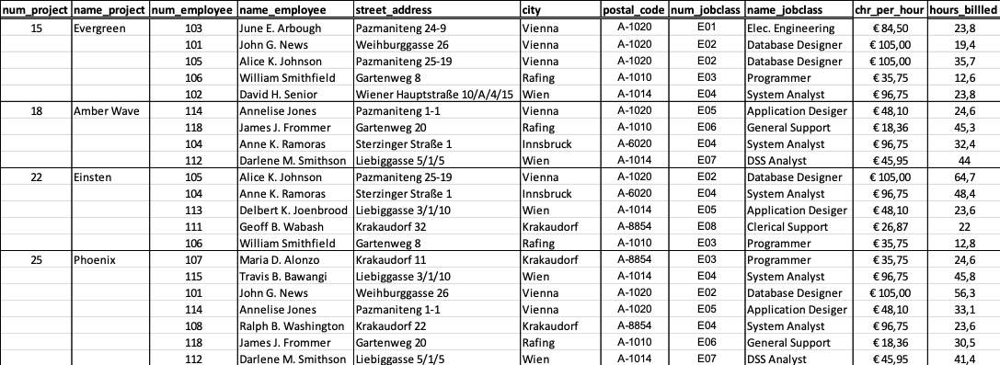
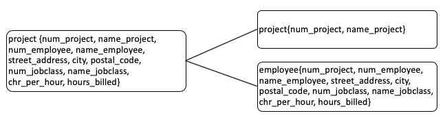
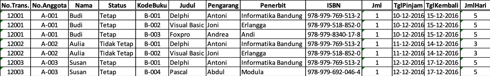
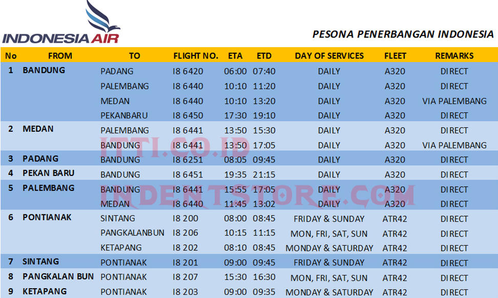

# Jobsheet Minggu ke-7: Normalisasi Data 1NF hingga 3NF

## Topik
Contoh Penerapan Normalisasi Data 1NF hingga 3NF

## Tujuan
Mahasiswa memahami:
1. Konsep normaslisasi skema relasional ke dalam bentuk yang diinginkan
2. Ciri-ciri tahapan normalisasi 1NF hingga 3NF

## Pendahuluan
### Pengertian normalisasi
Normalisasi diartikan sebagai suatu teknik yang menstrukturkan/ mendekomposisi/ memecah data dalam cara–cara tertentu untuk mencegah timbulnya permasalahan pengolahan data dalam basis data. Permasalahan yang dimaksud adalah berkaitan dengan penyimpangan–penyimpangan (anomalies) yang terjadi akibat adanya kerangkapan data dalam relasi dan inefisiensi pengolahan.
Proses normalisasi akan menghasilkan relasi yang optimal, yaitu :
1. Memiliki struktur record yang mudah untuk dimengerti.
2. Memiliki struktur record yang sederhana dalam pemeliharaan.
3. Memiliki struktur record yang mudah untuk ditampilkan kembali untuk memenuhi kebutuhan pemakai.
4. Minimalisasi kerangkapan data guna meningkatkan kinerja sistem.
	
Dalam pendekatan normalisasi, perancangan basis data bertitik tolak dari situasi nyata. Ia telah memiliki item–item data yang siap ditempatkan dalam baris dan kolom pada tabel–tabel relasional. Demikian juga dengan sejumlah aturan tentang keterhubungan antara item–item data tersebut. Sementara pendekatan model data ER lebih tepat dilakukan jika yang diketahui baru prinsip sistem secara keseluruhan. 

### Atribut Tabel
Atribut identik dengan pemakaian istilah kolom data. Istilah atribut ini lebih umum digunakan dalam perancangan basis data, karena istilah itu lebih impresif dalam menunjukkan fungsinya sebagai pembentuk karakteristik (sifat–sifat) yang melekat pada sebuah table.
1. **Atribut Sederhana (Simple Attribute) dan Atribut Komposit (Composite Attribute)**

    Atribut sederhana adalah atribut atomik yang tidak dapat dipilah lagi. Sementara atribut komposit merupakan atribut yang masih dapat diuraikan lagi menjadi sub–sub atribut yang masing–masing memiliki makna.

2. **Atribut Bernilai Tunggal (Single Valued Attribute) dan Atribut Bernilai Banyak (Multi Valued Atrtribute)**

    Atribut bernilai tunggal ditujukan pada atribut–atribut yang memiliki paling banyak satu nilai untuk setiap basis data. Pada data mahasiswa, semua atribut (nim, nama_mhs, alamat_mhs dan tgl_lahir) merupakan atribut bernilai tunggal, karena atribut–atribut tersebut hanya dapat berisi 1 (satu) nilai. Jika seorang mahasiswa yang memiliki 2 (dua) tempat tinggal, maka hanya salah satu saja yang boleh diisikan ke dalam atribut alamat_mhs.

3. **Atribut Harus Bernilai (Mandatory Attribute) dan Nilai Null**

    Ada sejumlah atribut pada sebuah tabel yang kita tetapkan harus berisi data. Jadi nilainya tidak boleh kosong. Atribut semacam ini disebut Mandatory Attribute. Pada tabel mahasiswa, misalnya atribut nim dan nama_mhs dapat kita golongkan sebagai Mandatory Attribute, karena setiap mahasiswa yang datanya ingin disimpan ke tabel tersebut, paling tidak harus diketahui dengan pasti nim dan namanya. Sebaliknya ada atribut–atribut lain dari suatu tabel yang nilainya boleh dikosongkan (Non Mandatory Attribute). Nilai Null digunakan untuk menyatakan/ mengisi atribut–atribut demikian yang nilainya memang belum siap atau tidak ada.

4. **Atribut Turunan**

    Atribut turunan adalah atribut yang nilai–nilainya diperbolehkan dari pengolahan atau dapat diturunkan dari atribut atau tabel lain yang berhubungan. Atribut demikian sebetulnya dapat ditiadakan dari sebuah tabel, karena nilai–nilainya bergantung pada nilai yang ada di atribut lainnya. Penambahan atribut angkatan dan IP (Indeks Prestasi) pada tabel mahasiswa merupakan contoh atribut turunan

### Domain dan Tipe Data
+ Penetapan tipe data pada setiap atribut (kolom) digunakan untuk keperluan penentuan struktur setiap tabel. Penetapan tipe data ini akan berimplikasi pada adanya batas–batas nilai yang mungkin disimpan/diisikan ke setiap atribut tersebut. Jika kita menetapkan bahwa tipe data untuk sebuah atribut adalah integer, maka kita hanya mungkin untuk menyimpan data angka yang bulat diantara –32.768 hingga 32.768. Kita tidak mungkin untuk memasukkan data di luar batas nilai tersebut, data pecahan apalagi data berupa string/text.
+ Domain memiliki banyak kesamaan pengertian dengan fungsi tipe data tersebut. Akan tetapi, tipe data merujuk pada kemampuan penyimpanan data yang mungkin bagi suatu atribut secara fisik, tanpa melihat layak tidaknya data tersebut bila dilihat dari kenyataan pemakaiannya. Sementara domain nilai lebih ditetapkan pada batas–batas nilai yang diperbolehkan bagi suatu atribut, dilihat dari kenyataanya yang ada.
+ Contoh : pada tabel kuliah, ditetapkan tipe data untuk atribut sks adalah integer. Dengan begitu secara fisik kita dapat menyimpan nilai –1, 0 atau 100 untuk atribut sks. Tetapi kita mengetahui dengan pasti, bahwa nilai–nilai tersebut tidak pantas (invalid) untuk menjadi data pada atribut sks. Lalu nilai–nilai yang boleh (valid) untuk atribut sks adalah 1, 2, 3, 4 dan 6, maka dapat dikatakan, domain nilai untuk atribut sks adalah 1, 2, 3, 4 dan 6.

### Ketergantungan Fungsional (Fungsional Dependency)
Diberikan sebuah tabel T berisi paling sedikit 2 buah atribut, yaitu A dan B. Kita dapat menyatakan notasi berikut ini:

A &#8594; B

Yang berarti A secara fungsional menentukan B atau B secara fungsional tergantung pada A, jika dan hanya jika setiap kumpulan baris (row) yang ada di tabel T, pasti ada 2 baris data (row) di tabel dengan nilai A yang sama, maka nilai B pasti juga sama. Definisi yang paling formal untuk itu adalah :
Diberikan 2 row  r1 dan r2 dalam tabel T dimana A &#8594; B.
    jika `r1(A) = r2(A) maka r1(B) = r2(B)`

Dengan melihat data di atas dan dengan pertimbangan intuisi kita, maka ketergantungan fungsional yang dapat kita ajukan adalah:

+ nim &#8594; nama_mhs

    yang berarti bahwa atribut nama_mhs hanya tergantung pada atribut nim. Hal ini dibuktikan dari fakta : untuk setiap nilai nim yang sama maka pasti nilai nama_mhsnya juga sama.

+ nama_kul, nim &#8594; indeks_nilai

    yang berarti bahwa atribut indeks_nilai tergantung pada atribut nama_kul dan nim secara bersama–sama, memang kita tidak dapat menunjukkan fakta, bahwa untuk setiap nilai nama_kul dan nim yang sama, maka nilai indeks_nilainya juga sama, karena nama_kul, nim merupakan key (sehingga bersifat unik) untuk tabel tersebut. Tetapi, ketergantungan fungsional tersebut sesuai dengan pengertian bahwa setiap indeks_nilai diperuntukkan pada mahasiswa tertentu untuk mata kuliah tertentu yang diambilnya. 

Tanpa memperhatikan pengertian ketergantungan secara alamiah terhadap tabel tersebut, kita juga dapat mengajukan sejumlah ketidaktergantungan (non KF) dengan hanya melihat fakta yang ada,yaitu :

+ nama_kul &#8603; nim

    yang artinya atribut nim tidak tergantung pada atribut nama_kul. Buktinya terlihat pada row 1 dan row 2 : dengan nilai nama_kul yang sama, tapi nilai nimnya berbeda.

+ nim &#8603; nideks_nilai
    
    yang artinya atribut indeks_nilai tidak bergantung pada atribut nim. Buktinya terlihat pada row 1 dan row 3 : dengan nilai nim yang sama, tapi nilai indeks_nilai berbeda.

### Normalisasi dan Ketergantungan Fungsional
Dalam perspektif normalisasi, sebuah basis data dapat dikatakan baik, jika setiap tabel yang menjadi unsur pembentuk basis data tersebut juga telah berada dalam keadaan baik atau normal. Selanjutnya, sebuah tabel dapat dikategorikan baik (efisien) atau normal, jika telah memenuhi 3 (tiga) kriteria berikut :
1. Jika ada dekomposisi (penguraian) tabel, maka dekomposisinya harus dijamin aman (Lossless–Join Decomposition).
2. Terpeliharanya ketergantungan fungsional pada saat perubahan data (Dependency Preservation).
3. Tidak melanggar `Boyce–Code Normal Form (BCNF)`

### Lossless–Join Decomposition
Dekomposisi memang merupakan upaya untuk mendapatkan tabel yang baik. Tetapi jika tidak hati–hati, upaya ini justru dapat menghasilkan kesalahan. Dekomposisi yang benar terjadi jika tabel–tabel hasil dekomposisi kita gabungkan kembali dapat menghasilkan tabel awal sebelum didekomposisi. Dekomposisi yang benar semacam ini disebut Lossless–Join Decomposition atau Lossless Decomposition (dekomposisi aman).

Di bawah ini contoh abstrak yang menghasilkan dekomposisi tidak aman (Lossy–Join Decomposition) :
Diasumsikan ada table XYZ yang didefinisikan dua buah ketergantungan fungsional   X &#8594; Y dan Y &#8594; Z. Kedua ketergantungan fungsional tersebut diperoleh dari pengamatan terhadap data yang kurang memadai atau karena asumsi yang kurang tepat.

### Dependency Preservation
Dependency Preservation (pemeliharaan ketergantungan) merupakan kriteria kedua yang harus dapat dicapai untuk mendapatkan tabel dan basis data yang baik. Ketika kita melakukan perubahan data, maka harus bisa dijamin agar perubahan tersebut tidak menghasilkan inkonsistensi data yang mengakibatkan ketergantungan fungsional yang sudah benar menjadi tidak terpenuhi. Akan tetapi, dalam upaya untuk memelihara ketergantungan fungsional yang ada untuk tetap terpenuhi tersebut, prosesnya harus dapat dilakukan dengan efisien.

Bentuk–Bentuk Normalisasi 
Normalisasi data adalah proses yang berkaitan dengan model data relasional untuk mengorganisasi himpunan data dengan ketergantungan dan keterkaitan yang tinggi/ erat. Hasil dari proses normalisasi adalah tabel–tabel data dalam bentuk normal (normal form),  yaitu tabel–tabel data yang terhindar dari :

+ Pengulangan informasi.
+ Potensi inkonsistensi data pada operasi pengubahan.

### Bentuk Normal Tahap Pertama (1st Normal Form)
Suatu tabel memenuhi 1stNF jika dan hanya jika tabel tersebut tidak memiliki atribut bernilai banyak atau lebih dari satu atribut dengan domain nilai yang sama.

### Bentuk Normal Tahap Kedua (2nd Normal Form)
Suatu tabel memenuhi 2ndNF jika dan hanya jika :
1.	Tabel tersebut memenuhi 1stNF
2.	Setiap atribut yang bukan kunci utama (primary key) tergantung secara fungsional terhadap semua atribut kunci utama dan bukan tergantung secara fungsional hanya pada sebagian atribut kunci utama.

### Bentuk Normal Tahap Ketiga (3rd Normal Form)
Suatu tabel memenuhi bentuk normal 3rdNF jika dan hanya jika :
1.	Tabel tersebut memenuhi 2ndNF.
2.	Tidak ada atribut bukan kunci tergantung secara transitive pada kunci utama.

## Langkah-langkah prakikum
**Langkah 1**
 
1. Bukalah berkas spreadsheet bernama `DataSoftwareHouseAustria.XLSX` di [sini](files/DataSoftwareHouseAustria.xlsx) yang dilampirkan bersama jobsheet ini. 
2. File tersebut berisi data pegawai software house di Austria beserta atribut lain yang mendukung project yang dikerjakan di perusahaan tersebut. 
3. Teliti setiap atribut yang tertulis pada data tersebut dan amati ketidak sesuaian atribut yang ada sehingga mempersulit proses insert, update, delete dan modifikasi. 
4. Pertimbangkan pula bagaimana bentuk yang baik dan sesuai dengan aturan normalisasi yang efisien.

   

**Langkah 2**

1. Normalisasi data sesuai bentuk normal kesatu karena data pada langkah 1 tidak memenuhi bentuk normal data bagian satu (1NF). Maka akan menghasilkan dekomposisi tabel sebagai berikut :

   
   
   
   
2. Lakukan pengecekan (Lossless–Join Decomposition) pada tabel baru hasil dekomposisi tersebut! \<SOAL>

**Langkah 3**

1. Pengecekan FD pada tabel hasil langkah 2 akan menghasilkan data FD sebagai berikut :

   Pada tabel project

    num_project &#8594; name_project
    
    Pada tabel employee
    + {num_project, num_employee, num_jobclass} &#8603; name_employee
    + {num_project, num_employee, num_jobclass} &#8603; street_address
    + {num_project, num_employee, num_jobclass} &#8603; city
    + {num_project, num_employee, num_jobclass} &#8603; postal_code
    + {num_project, num_employee, num_jobclass} &#8603; name_jobclass
    + {num_project, num_employee, num_jobclass} &#8603; chr_per_hour
    + {num_project, num_employee, num_jobclass} &#8603; hours_billed
    
    **FD**
    
    + <u>num_project</u> &#8594; name_project
    + <u>no_employee</u> &#8594;{name_employee, street_address, city, postal_code}
    + <u>no_jobclass</u> &#8594;{name_jobclass, chr_per_hours}
    + {<u>num_project</u>, num_employee,num_jobclass} &#8594; hours_billed

2. Normalisasi tabel menjadi bentuk 2NF. Berdasarkan informasi FD maka dekomposisi tabel yang semula 2 tabel menjadi 4 tabel sebagai berikut :
    + project{<u>num_project</u>, name_project}
    + employee{<u>no_employee</u>, name_employee, street_address, city, postal_code}
    + jobclass{<u>no_jobclass</u>, name_jobclass, chr_per_hours}
    + hours{<u>num_project, num_employee,num_jobclass</u>, hours_billed}
3.	Lakukan pengecekan `(Lossless–Join Decomposition)` dan `(dependency preservation)` pada tabel baru hasil dekomposisi tersebut! \<SOAL>

**Langkah 4**

1. Mencari hubungan syarat 3NF dengan mempertimbangkan X &#8594; A sesuai dengan ketentuan 3NF Terdapat beberapa non key yang memiliki ketergantungan dengan non key lain, sesuai FD baru sebagai berikut:
   + {city, street_address} &#8594; postal_code dimana X adalah superkey 
   + name_project &#8594; {name_employee, name_jobclass} dimana X adalah superkey 
   + {name_employee, name_jobclass} &#8594; chr_per_hours dimana dimana X adalah superkey
2. Berdasarkan FD tersebut maka tabel pada langkah 3 diperbaharui dekomposisinya menjadi :
    + project{<u>num_project</u>, name_project}
    + employee{<u>no_employee</u>, name_employee, street_address }
    + jobclass{<u>no_jobclass</u>, name_jobclass, chr_per_hours}
    + hours{<u>num_project</u>, num_employee,num_jobclass, hours_billed}
    + **address{<u>city, street_address</u>, postal_code**}
    + **jobclass_detail{<u>name_project</u>, name_employee, name_jobclass}**
    + **charge{<u>name_employee, name_jobclass</u>, chr_per_hours}**
3.	Lakukan pengecekan `(Lossless–Join Decomposition)` dan `(dependency preservation)` pada tabel baru hasil dekomposisi tersebut! \<SOAL>

## Tugas
1. Jawablah \<SOAL> dengan terlebih dahulu melakukan langkah-langkah kegiatan diatas!
2. Lakukan normalisasi sesuai dengan langkah-langkah percobaan diatas sekaligus lakukan pengecekan mulai bentuk 1NF sampai dengan 3NF yang sesuai dengan 3 kriteria bentuk normal yang baik pada studi kasus di bawah ini!

   

    Sebuah data peminjaman perpustakaan di Politeknik Negeri Balikpapan berikut memiliki keistimewaan pada jumlah hari peminjaman buku. Semakin lama jumlah hari peminjaman diartikan semakin banyak jumlah halaman buku yang dipinjam.
3. Lakukan normalisasi pada studi kasus di bawah ini mulai bentuk 1NF sampai dengan 3NF, sekaligus lakukan pengecekan yang sesuai dengan 3 kriteria bentuk normal yang baik! (Bentuk normalisasi tidak dibatasi, silahkan disesuaikan dengan kondisi studi kasus)
Indonesia Air memiliki data penerbangan domestik yang rutin dilaksanakan dalam periode tertentu.

   

4. Dokumentasikan jawaban pertanyaan 1 sampai 3 dalam sebuah laporan dengan format **PDF**!

## Daftar Pustaka
+ Dwi Puspitasari, S.Kom, “Buku Ajar Dasar Basis Data”, Program Studi Manajemen
Informatika Politeknik Negeri Malang, 2012.
+ Fathansyah, “Basisdata Revisi Kedua”, Bandung: Informatika, 2015.