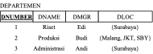
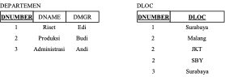
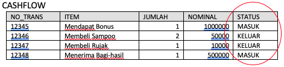
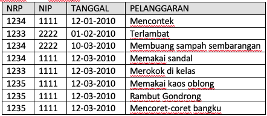
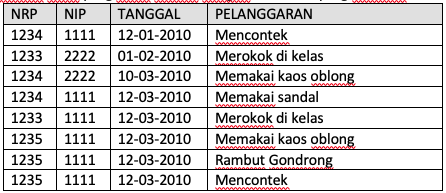
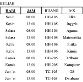
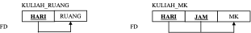
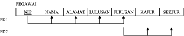
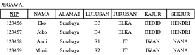
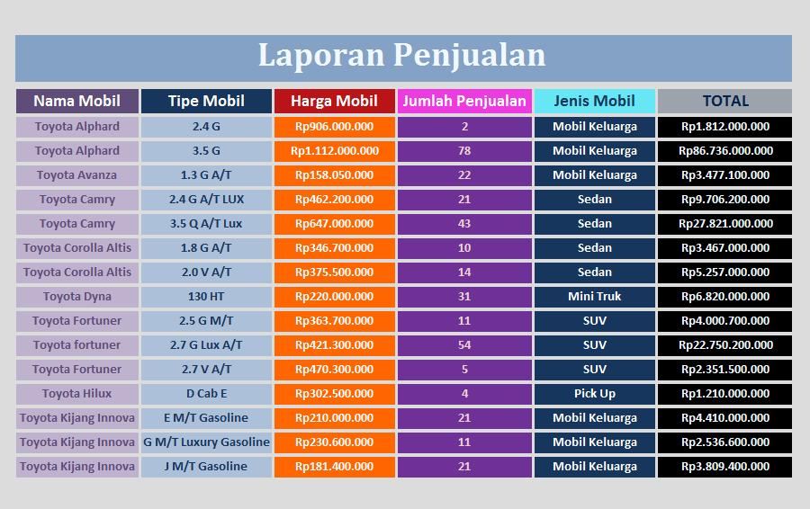

# Jobsheet-8: Normalisasi Data BCNF, 4NF, dan 5NF

## Topik 
Contoh Normalisasi Data BCNF, 4NF, dan 5NF

## Tujuan
Mahasiswa memahami:
1. Konsep normaslisasi skema relasional ke dalam bentuk yang diinginkan
2. Ciri-ciri tahapan normalisasi 1NF hingga 5NF

## Pendahuluan
### Pengertian
Normalisasi merupakan sebuah teknik dalam logical desain sebuah basis data yang mengelompokkan atribut dari suatu relasi sehingga membentuk struktur relasi yang baik (tanpa redudansi). Normalisasi adalah proses pembentukan struktur basis data sehingga sebagian besar ambiguity bisa dihilangkan. Normalisasi adalah suatu teknik yang menstrukturkan data dalam cara-cara tertentu untuk membantu mengurangi atau mencegah timbulnya masalah yang berhubungan dengan pengolahan data dalam basis data. Kriteria yang mendefinisikan level-level pada normalisasi adalah bentuk normal (norm form)

### Tujuan normalisasi
Normalisasi perlu dilakukan agar kerelasian dalam basis data menjadi mudah dimengerti, mudah dipelihara, mudah memprosesnya, dan mudah untuk dikembangkan sesuai kebutuhan baru

### Penyimpangan dalam modifikasi
+ Penyimpangan dalam proses modifikasi data disebut anomalies
+ Ada 3 bentuk penyimpangan :
    - Delete anomalies
        
        Adalah proses penghapusan suatu entity logik yang mengakibatkan hilangnya informasi tentang entity yang tidak direlasikan secara logik
        
        Contoh :
        
        <table>
                            <tr>
                                <td>Nomhs </td>
                                <td>Nama</td>
                                <td>Kode Mtk</td>
                                <td>SKS</td>
                            </tr>
                            <tr>
                                <td>123456</td>
                                <td>Ali baba</td>
                                <td>INA 101</td>
                                <td>3</td>
                            </tr>
                            <tr>
                                <td>123457</td>
                                <td>Pipiyot</td>
                                <td>TFD 234</td>
                                <td>2</td>
                            </tr>
                            <tr>
                                <td>123467</td>
                                <td>Nirmala</td>
                                <td>INA 201</td>
                                <td>3</td>
                            </tr>
                            <tr>
                                <td>123445</td>
                                <td>Lala</td>
                                <td>INA 101</td>
                                <td>3</td>
                            </tr>
                        </table>

        Apabila “Ali baba” membatalkan mengambil matakuliah “INA 101”, maka apabila record tersebut dihapus akan menyebabkan seluruh informasi tentang ‘Ali baba” akan ikut terhapus
        
    - Insert anomalies
    
        Adalah proses penyisipan entity logik yang memerlukan penyisipan entity logik yang lain
        
    - Update anomalies
        
        Adalah proses mengupdate data pada suatu entity logik yang mengakibatkan perubahan pada lebih dari satu tempat dalam suatu relasi
        
        Contoh : Perubahan SKS pada “INA 101” tidak hanya dilakukan pada satu record saja, tetapi pada record dan relasi lain yang memuat data tersebut
        
### Keharusan menghilangkan masalah-masalah akibat ketergantungan
+ Yang harus dilakukan adalah jika struktur data dalam relasi dirancang sedemikian rupa sehingga atribut-atribut bukan kunci hanya tergantung pada atribut kunci dan tidak pada atribut lain
+ Ada 3 ketergantungan :
    - Functional Dependence (FD)
        
        - FD akan muncul diantara dua rinci data dalam suatu struktur data jika nilai salah satu rinci data mengimplikasikan nilai pada rinci data kedua
        - Atau rinci data pertama menentukan (determines) rinci data kedua
        - Contoh :
        
            Matakuliah (Kode, Nama, SKS, Semester)
            
            FD = Matakuliah.Kode &#8594; (Matakuliah.Nama, Matakuliah.Semester)
            
            Matakuliah.nama &#8594; (Matakuliah.Kode, Matakuliah.Semester)
    - Full Functional Dependence (FFD)
    
        - Suatu rinci data dikatakan FFD pada suatu kombinasi rinci data jika FD pada kombinasi rinci data dan tidak FD pada bagian lain dari kombinasi rinci data
        - Contoh : SKS pada tabel matakuliah hanya bergantung pada kode matakuliah, dan tidak ditentukan oleh siapa yang mengambil matakuliah tersebut
    - Transitive Dependence (TD)
        - Muncul jika suatu nilai pada rinci data pertama menentukan nilai pada rinci data kedua yang bukan Candidate Key (CK), dan nilai pada rinci data kedua menentukan nilai pada rinci data ketiga
        - Jadi TD terjadi jika suatu nilai rinci data mempunyai ketergantungan pada dua nilai rinci data
        
### Efek-efek normalisasi
+ Akibat yang muncul dalam proses normalisasi :
    - Masalah kekangan dalam basis data
        * Duplikasi rinci data
        * Adanya Integritas referensial yang harus terjaga dan nilai-nilai pada Attribute Key (AK) tidak boleh null maka proses dekomposisi akan menghasilkan suatu set yang inheren pada batasan integritas referensial
    - Ketidakefisienan dalam menampilkan kembali data tersebut
        
### Atribut tabel
+ Atribut adalah karakteristik atau sifat yang melekat pada sebuah tabel, atau disebut juga kolom data
+ Pengelompokan atribut :
    - Atribut Key
        Adalah satu atau gabungan dari beberapa atribut yang dapat membedakan semua baris data dalam tabel secara unik (tidak boleh ada dua atau lebih baris data dengan nilai yang sama untuk atribut tetentu). Ada 3 key :
        * Superkey
         	Merupakan satu atau kumpulan atribut yang dapat membedakan setiap baris data dalam sebuah tabel secara unik
         	
         	Contoh : superkey di tabel mahasiswa

            - (nomhs, nama, alamat, tgllahir)
            - (nomhs, nama, tgllahir)
            - (nomhs, nama)
            - (nomhs)
        * Candidate key
         	Merupakan kumpulan atribut minimal yang dapat membedakan setiap baris data dalam sebuah tabel secara unik
         	Sebuah CK  pasti superkey, tapi belum tentu sebaliknya
         	
         	Contoh : pada tabel mahasiswa
            - (nomhs)
            - (nama)
        * Primary key
         	Dari beberapa CK dapat dipilih satu untuk dijadikan PK, yang memiliki keunikan paling baik
        	
            Contoh : dari tabel mahasiswa, yang layak dijadikan PK adalah nomhs
        
    - Atribut deskriptif
        Merupakan atribut yang bukan merupakan anggota dari PK
    - Atribut sederhana
        Adalah atribut atomik yang tidak dapat dipilah lagi
        	
        Contoh : Nomhs, Nama
    - Atribut komposit
        Adalah atribut yang masih bisa diuraikan lagi menjadi sub-atribut yang masing-masing memiliki makna
        	
        Contoh : Alamat &#8594; Alamat, Kota, Propinsi, Kode Pos
    - Atribut bernilai tunggal
        Ditujukan pada atribut-atribut yang memiliki paling banyak satu nilai untuk setiap baris data
        
        Contoh : Nomhs, Nama, Tanggal lahir &#8594; hanya dapat berisi satu nilai untuk seorang mahasiswa
    - Atribut bernilai banyak
        Ditujukan pada atribut-atribut yang dapat diisi dengan lebih dari satu nilai, tapi jenisnya sama
        
        Contoh : pada tabel mahasiswa dapat ditambah atribut HOBBY, karena seorang mahasiswa dapat memiliki beberapa hobby
    - Atribut harus bernilai (mandatory)
        Adalah atribut yang nilainya tidak boleh kosong, atau harus ada nilainya. Misalnya data Nomhs dan Nama mahasiswa
        + Nilai NULL digunakan untuk mengisi atribut yang nilainya belum siap atau tidak ada
        + NULL (karakter ke 0) tidak sama dengan SPASI (karakter ke 32)
        
### Domain dan tipe data
+ Domain, memiliki pengertian yang hampir sama dengan tipe data, namun domain lebih ditekankan pada batas-batas nilai yang diperbolehkan pada suatu atribut
   
     Contoh : data SKS bertipe integer. Namun dalam kenyataan tidak ada sks yang bernilai negatif. Berarti domain nilai sks adalah integer > 0
+ Tipe data merujuk pada kemampuan penyimpanan data yang mungkin bagi suatu atribut secara fisik, tanpa melihat kelayakan data tersebut bila dilihat dari kenyataan pemakaiannya
        
### Bentuk-bentuk normal
+ Normalisasi merupakan sebuah teknik dalam logical desain sebuah basis data, teknik pengelompokan atribut dari suatu relasi sehingga membentuk struktur relasi yang baik (tanpa redundansi)
+ Bentuk-bentuk normal :
    - **First Normal Form (1NF)**
        * Tidak diperkenankan atribut dengan nilai jamak, komposit, dan segala kombinasinya yang akan menyebabkan redundansi
        * Contoh
            - Departemen {DNUMBER, DNAME,DMGR,DLOC}
            - DLOC memiliki kemungkinan lebih dari satu lokasi
            - Skema DEPARTEMEN dengan kunci DNUMBER
            
                
                
            - Instant DEPARTEMEN
            
                
                
            - 1NF dengan Redundansi, Kunci menjadi {DNUMBER dan DLOC}
            
                
                
            - 1NF tanpa redundansi, tabel dipecah menjadi dua
            
                
            
        * Contoh Lain:
            + CASHFLOW {NO_TRANSAKSI, ITEM, JUMLAH, NOMINAL, STATUS}
            + STATUS adalah atribut yang berisi data ”Keluar”/”Masuk” atau ”Debit”/”Kredit”
            + Dalam aplikasinya nanti, proses untuk memasukkan data ”Keluar” atau ”Masuk” bisa menimbulkan kesalahan data yang menyebabkan ketidak-konsistenan cara penulisan
            + Normalisasi NF1, STATUS dijadikan entiti baru dengan atribut STATUS dan atribut kunci baru (misalkan) KODE.
            
                
            
                Dilakukan NF1 menjadi:
            
                
                
        * Contoh Lain:
            + SISWA {NRP, NAMA, KELAS, JENIS_KELAMIN}
            + Jika penulisan JENIS_KELAMIN misalkan ”Laki-laki” atau ”Pria” atau ”Perempuan” atau ”Wanita” bisa menimbulkan masalah konsistensi
            + Kalau penulisan menggunakan ”L”/”P” atau ”1”/”2” masih dianggap benar
            + Normalisasi NF1, JENIS_KELAMIN dijadikan entiti baru dengan atribut KODE sebagai key dan JENIS_KELAMIN
        * Catatan:
            + Perbedaan antara redundansi dan tidak unik &#8594; lihat penjelasan mengenai mapping pada atribut jamak
            + Masalah penambahan kunci baru pada entiti yang tidak memiliki kunci (dianggap banyak data yang kembar atau tidak unik)  lihat penjelasan pada Catatan saat dilakukan mapping
                - Data yang “kebetulan kembar” bukan masalah, yang tidak diperbolehkan adalah data yang “benar-benar kembar”  lihat penjelasan mengenai perbedaan redundansi dan tidak unik.
        * Contoh lain:
            + Anggap ada suatu relasi MELANGGAR antara SISWA dan GURU dengan rasio N:M sehingga dalam mapping-nya harus dibuatkan entiti baru
            + Pada entiti baru tersebut memiliki atribut NRP, NIP, TANGGAL dan PELANGGARAN
            + Contoh data-datanya
            
                
                
            + Apakah atribut NRP, NIP dan TANGGAL tidak unik ? Ya, karena memang banyak data yang kembar
            + Apakah atribut tersebut redundant ? Ya, karena pada atribut tersebut digunakan untuk menyimpan data yang memang maksudnya sama. Contoh NRP 1235 disimpan berulang-ulang
            + Apakah entiti tersebut perlu dibuatkan kunci yang bersifat unik ? Tidak perlu, selama entiti PELANGGARAN dianggap memang tidak memerlukan kunci.
                - Kalau memang diinginkan suatu kunci ? Harus sudah dibuat sejak dirancang spesifikasi atau ERD, misalkan NO_PELANGGARAN
            + Apakah entiti tersebut perlu dinormalisasi (dipisahkan NRP, NIP dan TANGGAL menjadi entiti baru) ? Tidak
                - Mengapa ? Karena atribut tersebut sudah berupa data yang dianggap sederhana dan mungkin tidak dapat disederhanakan lagi.
                - Contoh, apakah ada kunci lain sebagai pengganti NRP ? Kalau ada, kunci ini seharusnya sudah digunaan saat merancang spesifikasi atau ERD
                - Contoh, apakah ada data lain yang lebih sederhana untuk menggantikan tanggal ?
            + Contoh tabel yang sama namun dengan data-data yang berbeda
            
                
                
            + Apakah atribut NRP, NIP, TANGGAL dan PELANGGARAN tidak unik ? Ya, karena memang banyak data yang kembar
            + Khusus untuk NRP, NIP dan TANGGAL sudah dibahas pada penjelasan sebelumnya
            + Apakah atribut PELANGGARAN berisi data yang redundant ? Ya, karena berisi data yang maksudnya sama
            + Apakah entiti tersebut perlu dinormalisasi dengan memisah atribut PELANGGARAN menjadi entiti baru ? Bisa Ya, bisa Tidak.  
            + Jika data-data pada atribut PELANGGARAN dimaksudkan berupa data yang bersifat mandiri, berupa keterangan yang boleh ditulis bebas, tidak mengapa menuliskan dengan cara yang berbeda meskipun maksudnya sama, maka tidak perlu dilakukan normalisasi.
                - Contoh, tidak mengapa menuliskan pelanggaran, misalkan, ”Memakai sandal”, dan kadang ditulis ”Memakai sandal jepit”.
            + Namun, jika diinginkan untuk jenis-jenis pelanggaran yang sama harus persis dituliskan sama, dan kelak ingin dilakukan analisa dengan cara mengelompokkan jenis pelanggaran, maka ini harus dilakukan normalisasi

    - **Second Normal Form (2NF)**
        + Ketergantungan fungsional secara penuh
            - Suatu atribut harus bergantung sepenuhnya dengan kunci utama, tidak boleh dengan kombinasi antara kunci utama dengan atribut lain
        + Contoh
        + Kuliah {Hari, Jam, Ruang MataKuliah}
            - Misalkan, ruang kuliah selalu sama pada satu hari, tetapi mata kuliah berbeda untuk jam kuliah tertentu
        + Ruang bergantung Hari (bergantung penuh)
        + MK bergantung Hari dan Jam (bergantung sebagian/tidak penuh/parsial)
        + Skema
        
            
            
        + Instant
        
            
            
        + Normalisasi bentuk ke dua (2NF)
        
            
            
    - **Third Normal Form (3NF)**
        + Ketergantungan fungsional langsung
        + Suatu atribut harus bergantung secara langsung dengan kunci utama, tanpa melalui perantara atribut lain (bergantung tidak langsung)
        + Contoh
            * Data Pegawai {NIP, NAMA, ALAMAT, LULUSAN, JURUSAN, KAJUR, SEKJUR}
            * Nama, Alamat, Lulusan, Jurusan bergantung langsung dengan NIP
            * Kajur dan Sekjur bergantung langsung dengan Jurusan dan bergantung tidak langsung dengan NIP
            * Skema
            
                
                
            * Instant
            
                
            
            * Normalisasi bentuk ke 3 (3NF)
            
                
                
    - Catatan:
        + Jika perancangan ERD dilakukan secara detil (segala aspek diperhitungkan), biasanya yang sering dilakukan hanya sampai NF1 (membuang redundansi), Sedangkan NF2 dan NF3 hampir tidak perlu dilakukan
        + Jangan menambahkan atribut baru, misalkan atribut kunci, dengan alasan tidak ada kunci atau alasan lainnya. Lakukan penambahan kunci dan sebagainya pada tahap masih di ERD atau di spesifikasinya. Pada saat Pemetaan (mapping atau pembuatan skema), tidak diperkenankan menambahkan atribut baru, kecuali entiti baru hasil dari relasi N:M atau relasi orde lebih dari 2 atau hasil dari Normalisasi.
    
    - **Boyce-Codd Normal Form (BCNF)**
        + Bentuk BCNF terpenuhi dalam sebuah tabel, jika untuk setiap functional dependency terhadap setiap atribut atau gabungan atribut dalam bentuk:	
    	X &#8594; Y maka X adalah super key 
        + tabel tersebut harus di-dekomposisi berdasarkan functional dependency yang ada, sehingga X menjadi super key dari tabel-tabel hasil dekomposisi 
        + Setiap tabel dalam BCNF merupakan 3NF. Akan tetapi setiap 3NF belum tentu termasuk BCNF . Perbedaannya, untuk functional dependency X  A, BCNF tidak membolehkan A sebagai bagian dari primary key.
    
    - **Four Normal Form (4NF)**
    
        Bentuk normal 4NF terpenuhi dalam sebuah tabel jika telah memenuhi bentuk BCNF, dan tabel tersebut tidak boleh memiliki lebih dari sebuah multivalued atribute .Untuk setiap multivalued dependencies (MVD) juga harus merupakan functional dependencies 
    
    - **Five Normal Form (5NF)**
    
        Bentuk normal 5NF terpenuhi jika tidak dapat memiliki sebuah lossless decomposition menjadi tabel-tabel yg lebih kecil. Jika 4 bentuk normal sebelumnya dibentuk berdasarkan functional dependency, 5NF dibentuk berdasarkan konsep join dependence. Yakni apabila sebuah tabel telah di-dekomposisi menjadi tabel-tabel lebih kecil, harus bisa digabungkan lagi (join) untuk membentuk tabel semula
        
### Praktikum

#### Langkah 1 : menganalisis tabel
1.  Bukalah berkas spreadsheet bernama [03.DataPasien](files/08-DataPasien.xlsx) yang dilampirkan bersama jobsheet ini. File tersebut berisi data pasien pada suatu rumah sakit.

    
    
2. Pada berkas tersebut buatlah sebuah ‘sheet’ baru. Beri nama sheet tersebut dengan nama ‘normalisasi’ dan beri nama sheet yang satunya dengan nama ‘data asli’. Kita akan menggunakan sheet ini untuk melakukan normalisasi tanpa mengubah data yang asli.

    
    
     + Teliti setiap atribut yang tertulis pada data tersebut dan amati ketidak sesuaian atribut yang ada sehingga mempersulit proses insert, update, delete dan modifikasi. 
     + Pertimbangkan pula bagaimana bentuk yang baik dan sesuai dengan aturan normalisasi yang efisien.
     
3. Lakukan pengecekan (Lossless–Join Decomposition) pada tabel baru hasil dekomposisi tersebut!\<SOAL>
 
#### Langkah 2
1. Normalisasi data sesuai bentuk normal kesatu karena data pada langkah 1 tidak memenuhi bentuk normal data bagian satu (1NF).

    
    
    Kemudian lakukan dekomposisi tabel sebagai berikut :
    
    Tabel pasien {Kode_dokter, Nama_dokter, kode_pasien, Nama_pasien, No_antrian, Tanggal_antrian, Jam_Antrian, Kode_suster, Nama_Suster, Kode_tindakan, Nama_tindakan, Biaya}
    
2. Pengecekan FD pada tabel hasil langkah 2 akan menghasilkan data FD sebagai berikut :
   Ketergantungan 
   
   {kode_dokter,kode_pasien,kode_suster,kode_tindakan } &#8603; nama_dokter
   
   {kode_dokter,kode_pasien, kode_suster,kode_tindakan } &#8603; nama_pasien
   
   {kode_dokter,kode_pasien, kode_suster,kode_tindakan } &#8603; nama_suster
   
   {kode_dokter,kode_pasien, kode_suster,kode_tindakan } &#8594; no_antrian
   
   {kode_dokter,kode_pasien, kode_suster,kode_tindakan } &#8594; tanggal_antrian
   
   {kode_dokter,kode_pasien, kode_suster,kode_tindakan } &#8594; jam_antrian
   
   {kode_dokter,kode_pasien, kode_suster,kode_tindakan } &#8603; nama_tindakan
   
   {kode_dokter,kode_pasien, kode_suster,kode_tindakan } &#8603; biaya
   
3. Normalisasi tabel menjadi bentuk 2NF. Berdasarkan informasi FD maka dekomposisi tabel yang semula 1 tabel menjadi 4 tabel sebagai berikut :
   
   ANTRIAN {kode_dokter,kode_pasien, kode_suster, kode_tindakan, no_antrian, tgl_antrian, jam_antrian} 
   
   DOKTER {kode_dokter,nama_dokter} 
   
   PASIEN {kode_pasien,nama_pasien} 
   
   SUSTER {kode_suster, nama_suster} 

   TINDAKAN {kode_tindakan,nama_tindakan,biaya}
   
Lakukan pengecekan (Lossless–Join Decomposition) pada tabel baru hasil dekomposisi tersebut! \<SOAL> 

#### Langkah 3
1. Mencari hubungan syarat 3NF dengan mempertimbangkan X &#8594; A sesuai dengan ketentuan 3NF. 
    **ANTRIAN {kode_dokter,kode_pasien, kode_suster,kode_tindakan, no_antrian, tgl_antrian, jam_antrian}** 
    no_antrian &#8594; tgl_antrian,jam_antrian
    
    Berdasarkan FD tersebut maka tabel pada langkah 3 diperbaharui dekomposisinya menjadi :
    
    **ANTRIAN {kode_dokter,kode_pasien, kode_suster,kode_tindakan, no_antrian } 
    
    **DETAIL_ANTRIAN {no_antrian, tgl_antrian, jam_antrian}**** 
    
    DOKTER {kode_dokter,nama_dokter} 
    
    PASIEN {kode_pasien,nama_pasien} 
    
    SUSTER {kode_suster,nama_suster} 
    
    PROSEDUR {kode_tindakan, nama_tindakan, biaya} 

2. Lakukan pengecekan (Lossless–Join Decomposition) pada tabel baru hasil dekomposisi tersebut! <SOAL>

### Tugas
1. Jawablah \<SOAL> dengan terlebih dahulu melakukan langkah-langkah kegiatan diatas!
2. Lakukan normalisasi sesuai dengan langkah-langkah percobaan di atas sekaligus lakukan pengecekan mulai bentuk 1NF sampai dengan 5NF yang sesuai dengan 3 kriteria bentuk normal yang baik pada studi kasus di bawah ini!
   
    
   
3. Lakukan normalisasi pada studi kasus di bawah ini, sekaligus lakukan pengecekan yang sesuai dengan  kriteria bentuk normal yang baik! (Bentuk normalisasi tidak dibatasi, silahkan disesuaikan dengan kondisi studi kasus)

   
   
4. Dokumentasikan jawaban pertanyaan 1 sampai 3 dalam sebuah laporan dengan format **PDF**!
    
    

