# Jobsheet-12: MySQL – Data Retrieval Language (DRL)

## Topik
Data Retrieval Language (DRL) pada DBMS MySQL

## Tujuan
Mahasiswa diharapkan dapat memahami penggunaan dan dapat membuat SQL statement SELECT dengan berbagai klausa.

## Pendahuluan
DRL atau DSL (Data Selection Language) adalah set perintah yang dgunakan untuk mengambil data dari server basis data. DRL terdiri dari klausa yang dapat dikembangkan lebih lanjut, antara lain:
1.	`FROM`: Memilih nama sebuah tabel 
2.	`WHERE`: Menunjukkan secara spesifik suatu row/baris yang akan dicari
3.	`GROUP BY`: Menyusung data ke dalam grup
4.	`HAVING`: Memilih diantara kelompok-kelompok data yang didefinisikan klausa GROUP BY
5.	`ORDER BY`: Secara spesifik digunakan untuk menentukan suatu baris pada kolom tertentu
6.	`AS`: Memberikan nama alias sementara untuk tabel atau kolom

DRL lebih diterapkan dalam beberapa hal dalam beberapa hal seperti :
1.	`QUERY`
2.	`SUB-QUERY`
3.	`FUNGSI AGREGASI`


### Query
Query merupakan operasi yang melibatkan satu atau lebih tabel untuk melakukan retrival data. Pengambilan data dilakukan dengan beberapa klausa berikut :
1.	`SELECT *` untuk memilih semua kolom
Format
        ```sql
        SELECT * FROM table_name;
        ```

2.	`SELECT` dengan `WHERE` untuk menampilkan baris dengan suatu kondisi
    
        Format
    
        ```sql
        SELECT column1, column2,...
        FROM table_name
        WHERE condition;
        ```
3.	`SELECT` dengan `DISTINCT` untuk menampilkan data dengan eliminasi data yang sama (duplicate)

        Format

        ```sql
        SELECT DISTINCT column FROM table_name;
        ```
4.	`SELECT` dengan `IN` untuk menampilkan data yang spesifik
        
        Format
        
        ```sql
        SELECT column_name(s)
                FROM table_name
                WHERE column_name IN (value1, value2, ...);
        ```
		
5.	`SELECT` dengan `BETWEEN` untuk menampilkan data pada jarak (range) tertentu
        
        Format
        
        ```sql
        SELECT column_name(s)
                FROM table_name
                WHERE column_name BETWEEN value1 AND value2;
        ```
6.	`SELECT` dengan `LIKE` untuk menampilkan data yang memiliki kemiripan dengan keyword yang diinginkan
        
        Format
        
        ```sql
        SELECT column1,column2,...
                FROM table_name
                WHERE columnN LIKE pattern;
        ```
7.	`SELECT` dengan `GROUP BY` untuk menampilkan susunan data dalam bentuk grup
        
        Format
        
        ```sql
        SELECT column1, column2,...
                condition
                FROM table_name
                GROUP BY column1, column2, ...;
        ```
8.	`SELECT` dengan `ORDER BY` untuk menampilkan baris secara spesifik dan terurut maju atau mundur

        Format
        
        ```sql
        SELECT column1, column2, ...
                FROM table_name
                ORDER BY column1, column2, ... ASC|DESC;
        ```
9.	`SELECT` dengan` AND, OR and NOT` untuk menampilkan data dengan kondisi dan atau atau tidak

        Format
        
        `AND`
        ```sql
        SELECT column1, column2, ...
                FROM table_name
                WHERE condition1 AND condition2 AND condition3 ...;
        ```

        `OR`
        ```sql
        SELECT column1, column2, ...
                FROM table_name
                WHERE condition1 OR condition2 OR condition3 ...;
        ```

        `NOT`
        ```sql
        SELECT column1, column2, ...
                FROM table_name
                WHERE NOT condition;
        ```
10.	`SELECT` dengan `UNION, INTERSECT dan EXCEPT` untuk menampikan data dengan operasi himpunan yang melibatkan lebih 
dari satu tabel
        
        Format
        `UNION`
        
        Tanpa duplikasi
        
        ```sql
        SELECT column_name(s) FROM table1
                UNION
                SELECT column_name(s) FROM table2;
        ```
                
        Dengan duplikasi
        ```sql
        SELECT column_name(s) FROM table1
                UNION ALL
                SELECT column_name(s) FROM table2;
        ```
        
        `INTERSECT`
        Tanpa duplikasi
        ```sql
        SELECT column_name(s) FROM table1
                INTERSECT
                SELECT column_name(s) FROM table2;
        ```
        
        Dengan duplikasi
        ```sql
        SELECT column_name(s) FROM table1
                INTERSECT ALL
                SELECT column_name(s) FROM table2;
        ```
        
        `EXCEPT`
        Tanpa duplikasi
        ```sql
        SELECT column_name(s) FROM table1
                EXCEPT
                SELECT column_name(s) FROM table2;
        ```
        
        Dengan duplikasi
        ```sql
        SELECT column_name(s) FROM table1
                EXCEPT ALL
                SELECT column_name(s) FROM table2;
        ```

### Sub Query
Sub-query adalah adanya query di dalam query lain. Sub-query juga disebut dengan perintah `SELECT` bersarang (nested SELECT). 
Retrival data dalam sub-query dilakukan oleh `SELECT` untuk menemukan data pada `SELECT` utama. Klausa `GROUP BY` dan `HAVING` 
juga dapat digunakan untuk retrival data pasa sub-query. Sub-query biasanya digunakan untuk test keanggotaan himpunan 
atau perbandingan himpunan dan kardinalitas. 
Format
Untuk test keanggotaan
```sql
SELECT column_name(s)
FROM table_name
WHERE column_name IN (SELECT STATEMENT);
```
atau
```sql
SELECT column_name(s)
FROM table_name
GROUP BY column1, column2, ...;
HAVING column_name IN (SELECT STATEMENT);
```
Untuk perbandingan himpunan
```sql
SELECT column_name(s)
FROM table_name 
operator
(SELECT STATEMENT);
```

### Fungsi Agregasi
Fungsi agregasi akan melakukan perhitungan kepada sekumpulan nilai dan menghasilkan suatu nilai tunggal.

Jenis: 
1.	`AVG` untuk menghitung rata-rata
Format

        ```sql
        SELECT AVG(column_name)
        FROM table_name
        WHERE condition;
        ```
2.	`MAX` untuk mencari nilai tertinggi
Format
        ```sql
        SELECT MAX(column_name)
        FROM table_name
        WHERE condition;
        ```
3.	`MIN` untuk mencari nilai terendah
Format
        ```sql
        SELECT MIN(column_name)
        FROM table_name
        WHERE condition;
        ```
4.	`SUM` untuk menjumlahkan sekumpulan nilai
Format
        ```sql
        SELECT SUM(column_name)
        FROM table_name
        WHERE condition;
        ```
5.	`COUNT()` untuk menunjukkan jumlah baris pada kolom yang diinginkan
Format
        ```sql
        SELECT COUNT(column_name)
        FROM table_name
        WHERE condition;
        ```

## Praktikum – Bagian 1: Membuat Database untuk Percobaan
1. Studi kasus yang digunakan sama dengan jobsheet DML dengan skema/model relasional/EER diagram dari database berikut.
 
    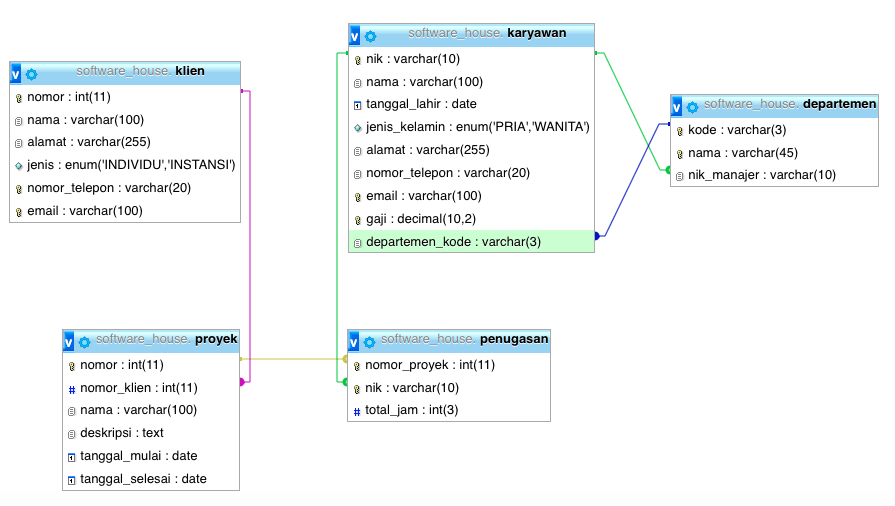
 
2. Skema tersebut adalah skema database pada sebuah sistem informasi yang digunakan oleh suatu perusahaan yang bergerak di bidang pembuatan perangkat lunak. Sesuai dengan percobaan pada jobsheet DML. Insert kembali departemen yang mengandung nama ‘dan’, dengan cara menyalin dari tabel departemen_backup, sehingga menghasilkan record keseluruhan tabel sebagai berikut (record tidak harus sama persis dengan tampilan ini):

    `SELECT * FROM departemen;`

    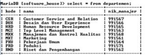
 
    `SELECT * FROM karyawan;`

    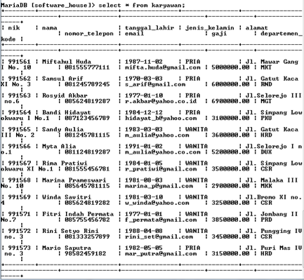
 
    `SELECT * FROM klien;`
 
    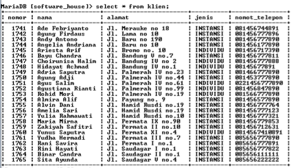
 
    `SELECT * FROM proyek;`

    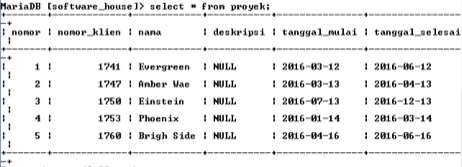
 
    `SELECT * FROM penugasan;`

    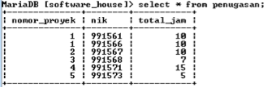
 
3. Setelah selesai membuat database diatas, lanjutkan ke Praktikum – Bagian 2.

## Praktikum – Bagian 2: Percobaan SELECT QUERY
1. Untuk menampilkan baris dengan suatu kondisi tertentu, digunakan statement SELECT dengan WHERE. Eksekusi SQL berikut untuk menampilkan (record) pada tabel karyawan yang memiliki kolom departemen_kode=’MKT’.
    ```sql
    SELECT nama 
    FROM karyawan 
    WHERE departemen_kode = 'MKT';
    ```
    
    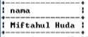
 
2. Untuk menampilkan data dengan eliminasi data yang sama (duplicate), digunakan statement SELECT dengan DISTINCT. Eksekusi SQL berikut untuk menampilkan kolom total_jam dari tabel penugasan yang bernilai tidak sama.
    ```sql
    SELECT DISTINCT total_jam 
    FROM penugasan;
    ```
    
    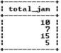
 
3. Untuk menampilkan data yang spesifik digunakan statement SELECT dengan IN. Eksekusi SQL berikut untuk menampilkan kolom nim dan nik dari tabel karyawan yang memiliki gaji 3100000 atau 6900000.
    ```sql
    SELECT nik, nama 
    FROM karyawan 
    WHERE gaji IN (3100000,6900000);
    ```
    
    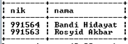
 
4. Untuk menampilkan data pada jarak (range) tertentu digunakan statement SELECT dengan BETWEEN. Eksekusi SQL berikut untuk menampilkan kolom nik dan nama dari tabel karyawan yang memiliki gaji diantara 2000000 dan 4000000.
    ```sql
    SELECT nik, nama 
    FROM karyawan 
    WHERE gaji 
    BETWEEN 2000000 AND 4000000;
    ```
    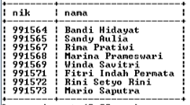
 
5. Untuk menampilkan data yang memiliki kemiripan dengan keyword yang diinginkan digunakan SELECT dengan LIKE. Eksekusi SQL berikut untuk menampilkan kolom nama, alamat, dan jenis pada tabel klien yang memiliki nama dengan huruf awal ‘a’.

    `SELECT nama, alamat, jenis FROM klien WHERE nama like 'a%';`
    
    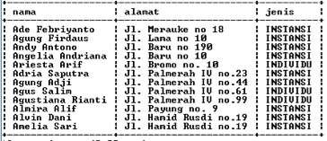
 
6. Untuk menampilkan susunan data dalam bentuk grup, digunakan SELECT dengan GROUP BY. Eksekusi SQL berikut untuk menampilkan kolom nik, nama, gaji, dan departemen_kode pada tabel karyawan yang dikelompokkan berdasarkan gaji.
    ```sql
    SELECT nik, nama, gaji, departemen_kode 
    FROM karyawan 
    GROUP BY gaji;
    ```
   
   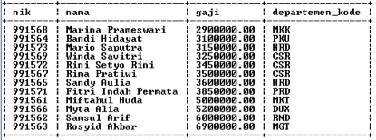
 
7. Untuk menampilkan baris secara spesifik dan terurut maju atau mundur, digunakan SELECT dengan ORDER BY. Eksekusi SQL berikut untuk menampilkan kolom nama dan tanggal_mulai pada tabel proyek dari tanggal yang paling lama hingga baru.
    ```sql
    SELECT nama, tanggal_mulai 
    FROM proyek 
    ORDER BY tanggal_mulai ASC;
    ``` 

    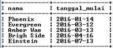
 
8. Untuk menampilkan data dengan kondisi dan atau atau tidak, digunakan SELECT dengan AND, OR and NOT. Eksekusi SQL berikut untuk menampilkan semua kolom pada tabel karyawan dengan jenis kelamin ‘WANITA’ dan gaji < 5000000.
    ```sql
    SELECT * 
    FROM karyawan 
    WHERE jenis_kelamin = 'WANITA' AND gaji < 5000000;
    ```
   
   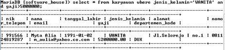
 
9. Untuk menampilkan data dari kolom yang terlibat dalam dua tabel dapat digunakan SELECT dengan UNION. UNION secara otomatis akan menghilangkan duplikasi. Eksekusi SQL berikut untuk menampilkan kolom nik yang yang ada di tabel penugasan atau departemen. 
    ```sql
    SELECT nik 
    FROM penugasan 
    UNION ALL 
    SELECT nik_manajer FROM departemen;
    ```
   
   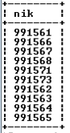
 
10. Untuk menampilkan data dari kolom yang terlibat dalam dua tabel dapat digunakan SELECT dengan UNION ALL. UNION ALL juga akan menampilkan duplikasi data. Eksekusi SQL berikut untuk menampilkan kolom nik yang yang ada di tabel penugasan atau departemen. 
    ```sql
    SELECT nik 
    FROM penugasan 
    UNION ALL 
    SELECT nik_manajer FROM departemen;
    ```
    
    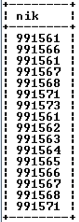
 
11. Setelah berhasil mengeksekusi SQL tersebut, lanjutkan ke Praktikum - Bagian 3.

## Praktikum - Bagian 3: Percobaan SELECT Sub-Query 
1. Untuk menampilkan data (test keanggotaan sub-query) yang berasal dari pemilihan tampilan data lain digunakan tambahan statement IN. Eksekusi SQL berikut untuk menampilkan kolom nomor_proyek, nik, total_jam pada tabel penugasan dimana total_jam adalah total_jam yang paling lama pada tabel penugasan.
    ```sql
    SELECT nomor_proyek, nik, total_jam 
    FROM penugasan 
    WHERE total_jam 
    in (SELECT MAX(total_jam) FROM penugasan);
    ```
   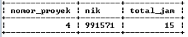
 
2. Untuk menampilkan data (perbandingan himpunan sub-query) yang berasal dari pemilihan tampilan data lain digunakan tambahan operator. Eksekusi SQL berikut untuk menampilkan kolom nomor_proyek, nik, total_jam pada tabel penugasan berdasarkan semua record kolom total_jam harus bernilai kurang dari total_jam yang dimiliki oleh nomor proyek 1 dari tabel penugasan.
    ```sql
    SELECT nomor_proyek, nik, total_jam 
    FROM penugasan 
    WHERE total_jam < ALL (SELECT total_jam FROM penugasan WHERE nomor_proyek = 1);
    ``` 
   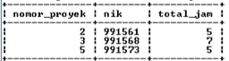

3. Setelah berhasil mengeksekusi SQL tersebut, lanjutkan ke Praktikum - Bagian 4.

## Praktikum - Bagian 4: Percobaan FUNGSI AGREGASI
1. Untuk menghitung rata-rata, digunakan tambahan statement AVG. Eksekusi SQL berikut untuk menampilkan rata-rata gaji sesuai kolom gaji dari tabel karyawan.

    `SELECT AVG(gaji) FROM karyawan;`
    
    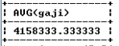
 
2. Untuk menghitung nilai tertinggi, digunakan tambahan statement MAX. Eksekusi SQL berikut untuk menampilkan gaji tertinggi sesuai kolom gaji dari tabel karyawan. 
    
    `SELECT MAX(gaji) FROM karyawan;`
    
    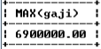
 
3. Untuk menghitung nilai terendah, digunakan tambahan statement MIN. Eksekusi SQL berikut untuk menampilkan gaji terendah sesuai kolom gaji dari tabel karyawan. 
    
    `SELECT MIN(gaji) FROM karyawan;`
    
    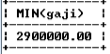
 
4. Untuk menghitung total gaji keseluruhan digunakan tambahan statement SUM. Eksekusi SQL berikut untuk menampilkan total gaji sesuai kolom gaji dari tabel karyawan. 
    
    `SELECT SUM(gaji) FROM karyawan`
    
    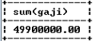
 
5. Untuk menunjukkan jumlah baris pada kolom yang diinginkan digunakan COUNT(). Eksekusi SQL berikut untuk menampilkan jumlah baris pada kolom dari tabel karyawan.
    
    `SELECT COUNT(gaji) FROM karyawan;`
    
    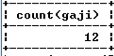
 
6. Lanjutkan ke bagian Tugas!

## Tugas
1. Himpunlah screenshot sintaksis SQL berikut hasil SELECT yang Anda dapat di komputer Anda pada bagian Praktikum dalam sebuah laporan dengan format PDF!
2. Bagaimana sintaksis untuk melakukan pencarian tanggal selesai proyek yang paling akhir dengan memberikan nama alias ‘baru’, dan juga pencarian tanggal selesai proyek paling awal dengan memberikan nama alias kolom ‘lama’?Tunjukkan outputnya!
3. Lakukan pencarian jumlah karyawan yang bekerja pada kode_departemen ‘CSR’ kemudian tunjukkan sintaksis dan outputnya!
4. Carilah data yang menunjukkan semua nik dari seorang manajer yang berperan dalam penugasan. Gunakan operasi intersect! Tunjukkan sintaksis dan output pencarian tersebut!
5. Tunjukkan total nik, nomor_proyek dan total_jam dari tabel penugasan yang dikelompokkan berdasarkan nomor proyek yang sama berjumlah kurang dari dua. Kelompok tersebut diurutkan sesuai nomor_proyek secara terurut dari atas ke bawah. Sertakan sintaksis dan output dari sintaksis SELECT tersebut. 

## Daftar Pustaka
+	Dwi Puspitasari, S.Kom, “Buku Ajar Dasar Basis Data”, Program Studi Manajemen Informatika Politeknik Negeri Malang, 2012.
+	[http://www.tutorialride.com](http://www.tutorialride.com)
+	[https://www.w3schools.com/](https://www.w3schools.com/)