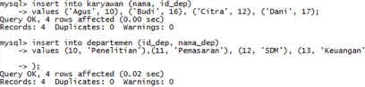
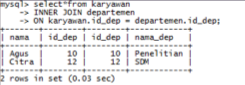
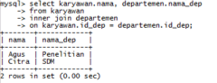
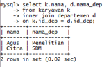
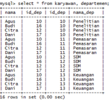
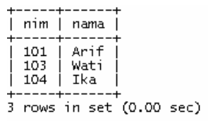
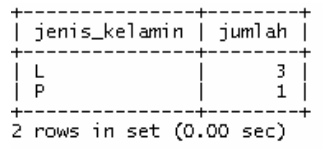
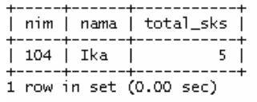

#Jobsheet-8: MySQL (Select JOIN)

## Topik 
Select JOIN

## Tujuan
Mahasiswa diharapkan dapat: 
1.	Memahami keterhubungan entitas di dalam basis data
2.	Memahami jenis-jenis operasi pengambilan data di beberapa entitas
3.	Mampu menyelesaikan kasus-kasus retrieval yang melibatkan lebih dari satu entitas

## Teori
1. Relationship

    Relationship adalah suatu hubungan antara beberapa entitas. Konsep ini sangat penting sekali di dalam basis data, di 
    mana memungkinkan entitas-entitas untuk saling berhubungan satu sama lain. Di dalam sebuah relationship, primary key 
    memiliki peran penting untuk mengaitkan entitas. Selain itu, primary key juga digunakan untuk mendefinisikan batasan 
    keterhubungan.
    
2. Join

    Join merupakan salah satu konstruksi dasar dari SQL dan basis data. Join dapat didefinisikansebagai kombinasi record 
    dari dua atau lebih tabel di dalam basis data relasional dan menghasilkan sebuah tabel (temporary) baru yang disebut 
    sebagai joined table.  Join dapat diklasifikasikan ke dalam dua jenis: inner dan outer. 
    + Inner Join
    
        Inner join pada dasarnya adalah menemukan persimpangan (intersection) antara dua buah tabel. 
        Sintaks inner join diperlihatkan sebagai berikut:       
        ```sql
        SELECT A1, A2, ..., An 
        FROM r1 
        INNER JOIN r2 
        ON r1.join_key = r2.join_key
        ```
      Inner join juga dapat direpresentasikan dalam bentuk implisit.
        ```sql
        SELECT A1, A2, ..., An 
        FROM r1, r2 
        WHERE r1.key = r2.key 
        ```
      Misalkan terdapat tabel A dan B, maka hasil inner join dapat diperlihatkan—sebagai bidang terarsir—dalam diagram 
      Venn seperti Gambar 1.
      
      
      
      Gambar 1. Inner Join
      
    + Outer Join
        - Left Outer Join
        
            Left outer join (atau left join) mengembalikan semua nilai dari tabel kiri ditambah dengan nilai dari tabel 
            kanan yang sesuai (atau NULL jika tidak ada nilai yang sesuai).
            
            Sintaks
            ```sql
            SELECT A1, A2, ..., An 
            FROM r1 
            LEFT OUTER JOIN r2 
            ON r1.join_key = r2.join_key
            ```
          Left outer join antara tabel A dan B dapat diilustrasikan dalam diagram Venn seperti Gambar 2
          
          
          
          Gambar 2. Left Outer Join
          
         - Right Outer Join
         
            Right outer join (atau right join) pada dasarnya sama seperti left join,  namun dalam bentuk terbalik—kanan 
            dan kiri. Sintaks right outer join diperlihatkan sebagai berikut:
            
            Sintaks
            ```sql
            SELECT A1, A2, ..., An 
            FROM r1 
            RIGHT OUTER JOIN r2 
            ON r1.join_key = r2.join_key
            ```
            Right outer join antara tabel A dan B dapat diilustrasikan dalam diagram Venn seperti Gambar 3
            
             
            
            Gambar 3. Right Outer Join
            
         - Full Outer Join
         
            Full outer join (atau full join) pada hakekatnya merupakan kombinasi dari left dan right join. Sintaks full 
            outer join diperlihatkan sebagai berikut:
            
            Sintaks
            ```sql
            SELECT A1, A2, ..., An 
            FROM r1 
            FULL OUTER JOIN r2 
            ON r1.join_key = r2.join_key
            ```
            Bentuk visual dari full outer join dapat diperlihatkan menggunakan diagram Venn seperti Gambar 4.
            
           
           
           Gambar 4. Full Outer Join
           
           Selain empat jenis join yang utama di atas, masih ada beberapa variasi join lainnya, seperti CROSS JOIN 
           (cartesian product), NATURAL JOIN, dan sebagainya. Perlu juga diperhatikan, join bisa diimplementasikan dalam
            bentuk bersarang (nested join). Jadi, di dalam sebuah operasi join bisa terdapat operasi join lainnya.
            
## Praktikum
###	Relationship
+ Buat database `nama_kantor(isi dengan nama anda)`

    

+ Buat tabel karyawan dan tabel departemen dengan struktur sebagai berikut:

    ```sql
    CREATE TABLE karyawan ( nama varchar(30) NOT NULL, id_dep int(5) NOT NULL
    ) ENGINE=MyISAM;
  
      CREATE TABLE departemen ( id_dep int(5) NOT NULL, nama_dep varchar(30) NOT NULL, PRIMARY KEY (id_dep)
      ) ENGINE=MyISAM;
    ```
    Data yang digunakan adalah sebagai berikut:
    ```sql
      Tabel Karyawan
      Nama	id_dep
      Agus	10    
      Budi	16
      Citra	12
      Dani	17
      
      Tabel Departmen
      id_dep	nama_dep
      10	Penelitian
      11	Pemasaran
      12	SDM
      13	Keuangan
    ```
  
    
 
### Inner Join
Sebagaimana dijelaskan, inner join akan mengembalikan data di tabel A dan B yang sesuai. Sebagai contoh, kita bisa mendapatkan data karyawan yang memiliki departemen.
+ Data karyawan yang memiliki departemen

    Cara 1
    
    
 
    Cara 2
    
    
 
    Dalam pengambilan data ini, kita juga bisa menspesifikasikan field terkait. Sebagai contoh, hanya mengambil nama karyawan dan nama departemen saja.
    
    
 
    Agar penulisan SQL lebih efisien, kita dapat memanfaatkan fitur “ derived table” (atau alias).
 
    
 
    Pada pernyataan SQL di atas, tabel karyawan dinotasikan dengan huruf k dan tabel departemen menggunakan huruf d.
### Outer Join
+ Left Outer Join
    
    Data seluruh karyawan (yang memiliki departemen maupun tidak)
 
    
 
    Data karyawan yang tidak memiliki departemen
 
    

+ Right Outer Join

    
 
+ Full Outer Join
 
    
 
+ Cross Join
    
    Cara 1
    
    
 
    Cara 2
 
    
 
## Tugas 
Perhatikan, dalam mengerjakan tugas praktikum ini, sebaiknya pernyataan SQL disimpan di file untuk kemudian dieksekusi. Berikut adalah data-data tabel yang akan digunakan (sesuaikan nilainya agar sama persis).
<pre>
    Tabel mahasiswa
    nim	Nama	jenis_kelamin	alamat
    101	Arif		L	Jl. Kenangan				
    102	Budi		L	Jl. Jombang
    103	Wati		P	Jl. Surabaya
    104	Ika		P	Jl. Jombang
    105	Tono		L	Jl. Jakarta
    106	Iwan		L	Jl. Bandung				
    107	Sari		P	Jl. Malang
                    
    Tabel ambil_mk							
    nim	kode_mk			
    101	PTI447			
    103	TIK333			
    104	PTI333			
    104	PTI777			
    111	PTI123			
    123	PTI999
    
    Tabel matakuliah
    kode_mk	nama_mk	sks	semester
    PTI447	Praktikum Basis Data	1	3
    TIK342	Praktikum Basis Data	1	3
    PTI333	Basis Data Terdistribusi	3	5
    TIK123	Jaringan Komputer	2	5
    TIK333	Sistem Operasi	3	5
    PTI123	Grafika Multimedia	3	5
    PTI777	Sistem Informasi	2	3
</pre>

### Soal 
1. Dapatkan data mahasiswa yang mengambil matakuliah. Selesaikan dengan pendekatan join eksplisit dan implisit. Hindari duplikasi data.

    

2. Kelompokkan data mahasiswa yang tidak mengambil matakuliah berdasarkan jenis kelaminnya, kemudian hitung banyaknya.

    

3. Dapatkan nim dan nama mahasiswa yang mengambil matakuliah beserta kode_mk dan nama_mk yang diambilnya. Selesaikan dengan pendekatan join eksplisit dan implisit.

    
 
4. Dapatkan nim, nama, dan total sks yang diambil oleh mahasiswa, di mana total sksnya lebih dari 4 dan kurang dari 10.

    
 
5. Dapatkan  matakuliah  yang  tidak  diambil  oleh  mahasiswa  terdaftar (mahasiswa di tabel mahasiswa).

    
