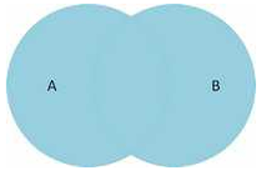

#Jobsheet-8: MySQL (Select JOIN)

## Topik 
Select JOIN

## Tujuan
Mahasiswa diharapkan dapat: 
1.	Memahami keterhubungan entitas di dalam basis data
2.	Memahami jenis-jenis operasi pengambilan data di beberapa entitas
3.	Mampu menyelesaikan kasus-kasus retrieval yang melibatkan lebih dari satu entitas

## Teori
1. Relationship

    Relationship adalah suatu hubungan antara beberapa entitas. Konsep ini sangat penting sekali di dalam basis data, di 
    mana memungkinkan entitas-entitas untuk saling berhubungan satu sama lain. Di dalam sebuah relationship, primary key 
    memiliki peran penting untuk mengaitkan entitas. Selain itu, primary key juga digunakan untuk mendefinisikan batasan 
    keterhubungan.
    
2. Join

    Join merupakan salah satu konstruksi dasar dari SQL dan basis data. Join dapat didefinisikansebagai kombinasi record 
    dari dua atau lebih tabel di dalam basis data relasional dan menghasilkan sebuah tabel (temporary) baru yang disebut 
    sebagai joined table.  Join dapat diklasifikasikan ke dalam dua jenis: inner dan outer. 
    + Inner Join
    
        Inner join pada dasarnya adalah menemukan persimpangan (intersection) antara dua buah tabel. 
        Sintaks inner join diperlihatkan sebagai berikut:       
        ```sql
        SELECT A1, A2, ..., An 
        FROM r1 
        INNER JOIN r2 
        ON r1.join_key = r2.join_key
        ```
      Inner join juga dapat direpresentasikan dalam bentuk implisit.
        ```sql
        SELECT A1, A2, ..., An 
        FROM r1, r2 
        WHERE r1.key = r2.key 
        ```
      Misalkan terdapat tabel A dan B, maka hasil inner join dapat diperlihatkan—sebagai bidang terarsir—dalam diagram 
      Venn seperti Gambar 1.
      
    + Outer Join
        - Left Outer Join
        
            Left outer join (atau left join) mengembalikan semua nilai dari tabel kiri ditambah dengan nilai dari tabel 
            kanan yang sesuai (atau NULL jika tidak ada nilai yang sesuai).
            
            Sintaks
            ```sql
            SELECT A1, A2, ..., An 
            FROM r1 
            LEFT OUTER JOIN r2 
            ON r1.join_key = r2.join_key
            ```
          Left outer join antara tabel A dan B dapat diilustrasikan dalam diagram Venn seperti Gambar
          
          
         - Right Outer Join
         
            Right outer join (atau right join) pada dasarnya sama seperti left join,  namun dalam bentuk terbalik—kanan 
            dan kiri. Sintaks right outer join diperlihatkan sebagai berikut:
            
            Sintaks
            ```sql
            SELECT A1, A2, ..., An 
            FROM r1 
            RIGHT OUTER JOIN r2 
            ON r1.join_key = r2.join_key
            ```
            Right outer join antara tabel A dan B dapat diilustrasikan dalam diagram Venn seperti Gambar
             
            
         - Full Outer Join
         
            Full outer join (atau full join) pada hakekatnya merupakan kombinasi dari left dan right join. Sintaks full 
            outer join diperlihatkan sebagai berikut:
            
            Sintaks
            ```sql
            SELECT A1, A2, ..., An 
            FROM r1 
            FULL OUTER JOIN r2 
            ON r1.join_key = r2.join_key
            ```
            Bentuk visual dari full outer join dapat diperlihatkan menggunakan diagram Venn seperti Gambar 4.
           
           Selain empat jenis join yang utama di atas, masih ada beberapa variasi join lainnya, seperti CROSS JOIN 
           (cartesian product), NATURAL JOIN, dan sebagainya. Perlu juga diperhatikan, join bisa diimplementasikan dalam
            bentuk bersarang (nested join). Jadi, di dalam sebuah operasi join bisa terdapat operasi join lainnya.